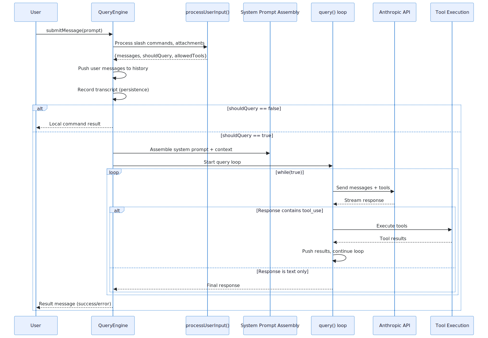

# 查询引擎 (QueryEngine)：Claude Code 的大脑

> 📚 本文档源自 [claude-reviews-claude](https://github.com/openedclaude/claude-reviews-claude) 项目，作为 Glaude 实现的参考分析。

> **源文件**：`QueryEngine.ts` (1,296 行), `query.ts` (1,730 行), `query/` 目录

## 太长不看，一句话总结

QueryEngine 是 Claude Code 整个生命周期的核心编排器。它负责拥有会话状态、管理 LLM 查询循环、处理流式传输、跟踪成本，并协调从用户输入处理到工具执行的一切工作。`query()` 中的核心循环是一个刻意设计的简单 `while(true)` 异步生成器（AsyncGenerator） —— 所有的智能都存在于 LLM 中，脚手架（Scaffold）被有意设计为“愚钝”的。

---

## 1. 两层架构：QueryEngine (会话级) + query() (回合级)

引擎被分为具有不同生命周期的两层：

<p align="center">
  
</p>

| 层级 | 生命周期 | 核心职责 |
|-------|----------|----------------|
| `QueryEngine` | 每个会话 (Conversation) | 会话状态、消息历史、累计用量、文件缓存 |
| `query()` | 每个用户消息 (Turn) | API 循环、工具执行、自动压缩、预算强制执行 |

---

## 2. submitMessage() 生命周期

每次调用 `submitMessage()` 都遵循一个精确的序列：

<p align="center">
  
</p>

### 第一阶段：输入处理
`processUserInput()` 处理：
- **斜杠命令** (`/compact`, `/clear`, `/model` 等)
- **文件附件** (图片、文档)
- **输入规范化** (内容块与纯文本的转换)
- **工具白名单**

如果 `shouldQuery` 为 false（例如 `/clear`），结果将直接返回，而不调用 API。

### 第二阶段：上下文组装
系统提示词从多个来源动态组装，包括 CLAUDE.md、当前目录信息、已安装技能以及插件提供的上下文。

### 第三阶段：query() 循环
核心循环是一个 `while(true)` 的异步生成器，它处理与 LLM 的多轮交互。

---

## 3. query() 循环：1,730 行代码下的“混沌控制”

`query.ts` 中的 `query()` 函数是工具执行的心脏。尽管长达 1,730 行，其核心结构却很简单：

```
while (true) {
    1. 预处理：snip → microcompact → context collapse → autocompact (压缩流水线)
    2. 调用 API：流式获取响应
    3. 后处理：执行工具，处理错误
    4. 决策：继续 (发现 tool_use) 或 终止 (end_turn)
}
```

### 预处理流水线

<p align="center">
  
</p>

在每次 API 调用前，消息会通过多级压缩：
- **工具结果预算**：限制工具输出的大小。
- **Snip (剪裁)**：移除陈旧的对话片段。
- **Microcompact (微压缩)**：缓存感知的文件编辑记录。
- **Context Collapse (上下文折叠)**：归档旧的回合。
- **Autocompact (自动压缩)**：当接近 Token 限制时进行全文摘要。

---

## 4. 状态管理：消息分发中心

在 `submitMessage()` 内部，一个大型 `switch` 语句负责路由每种消息类型（assistant, user, progress, stream_event, system 等）。设计关键点：**每种消息类型**都通过相同的 yield 管道分发，确保了通信路径的单一性和可靠性。

---

## 可迁移设计模式

> 以下来自 QueryEngine 的模式可直接应用于任何 LLM 交互编排系统。

### 模式 1：异步生成器 (AsyncGenerator) 作为通信协议
整个引擎通过 `yield` 进行通信。没有回调，没有事件触发器。异步生成器提供了背压（Backpressure）控制和完美的取消机制（`.return()`）。

### 模式 2：带有不可变快照的可变状态
引擎维护一个可变的消息数组以实现跨回合持久化，但在每次查询循环迭代时都会获取不可变快照。

### 模式 3：通过闭包注入权限限制
权限跟踪是透明注入的 —— 查询循环并不知道自己正在被监控。

### 模式 4：基于水印的错误范围界定
引擎通过保存最后一次错误的水印（参考）来回溯错误，而不是通过计数器。这种方式在环形缓冲区滚动时依然有效。

---

## 6. 成本与 Token 追踪：每一分钱都有迹可循

> 每次 API 调用都消耗真金白银。成本追踪系统是整个会话的财务账本 —— 按模型累积费用，集成 OpenTelemetry，并在会话恢复时持久化还原。

// 源码位置: src/cost-tracker.ts:278-323

### 累积流程

每次 API 返回响应时，`addToTotalSessionCost()` 执行一套多步记账流程：

```typescript
export function addToTotalSessionCost(cost, usage, model) {
  // 1. 更新按模型分组的用量 Map（输入、输出、缓存读写 Token）
  const modelUsage = addToTotalModelUsage(cost, usage, model)
  // 2. 递增全局状态计数器
  addToTotalCostState(cost, modelUsage, model)
  // 3. 推送到 OpenTelemetry 计数器（如已配置）
  getCostCounter()?.add(cost, attrs)
  getTokenCounter()?.add(usage.input_tokens, { ...attrs, type: 'input' })
  // 4. 递归计算顾问模型（Advisor）成本 —— 嵌套模型如 Haiku 分类器
  for (const advisorUsage of getAdvisorUsage(usage)) {
    totalCost += addToTotalSessionCost(advisorCost, advisorUsage, advisorUsage.model)
  }
  return totalCost
}
```

### 按模型用量映射

// 源码位置: src/cost-tracker.ts:250-276

系统以模型粒度进行追踪。每个模型维护独立的运行时统计，包含输入 Token、输出 Token、缓存读/写 Token、Web 搜索请求数、累计美元成本、上下文窗口大小和最大输出限制。

### 会话持久化与恢复

// 源码位置: src/cost-tracker.ts:87-175

成本可以在会话恢复（`--resume`）时存活。保存时所有累积状态被写入项目配置文件；恢复时 `restoreCostStateForSession()` 重新加载计数器 —— 但**仅当会话 ID 匹配时**才执行，防止跨会话的成本污染。

---

## 7. 错误恢复：优雅降级的艺术

> 查询循环中的错误处理不是事后补丁 —— 它是 `query.ts` 中第二大的子系统。系统实现了多层重试与恢复架构，将瞬态故障变成无感的小插曲。

### withRetry 引擎

// 源码位置: src/services/api/withRetry.ts:170-517

`withRetry()` 是一个异步生成器，为每次 API 调用套上精密的重试逻辑：

```
API 调用 → 出错?
  ├── 429 (限流)      → 指数退避重试（基数 500ms，上限 32s）
  ├── 529 (过载)      → 前台查询重试；后台查询立即放弃
  ├── 401 (认证失败)  → 刷新 OAuth Token，清除 API 密钥缓存，重试
  ├── 403 (Token 撤销) → 强制 Token 刷新，重试
  ├── ECONNRESET/EPIPE → 禁用长连接，重新建连
  ├── 上下文溢出        → 计算安全 max_tokens，重试
  └── 其他 5xx         → 标准指数退避重试
```

### 前台 vs 后台：查询的优先级分层

// 源码位置: src/services/api/withRetry.ts:57-89

一个关键优化：**529 错误仅对前台查询重试**。后台任务（摘要生成、标题提取、分类器）在 529 时立即放弃，避免在容量级联故障中制造放大效应。

### 模型降级触发

// 源码位置: src/services/api/withRetry.ts:327-364

连续 3 次 529 错误后，系统触发 `FallbackTriggeredError`。查询循环捕获后执行：为孤立消息生成墓碑标记 → 剥离 Thinking 签名（签名与模型绑定） → 用备用模型重试。

### 持久重试模式 (UNATTENDED_RETRY)

// 源码位置: src/services/api/withRetry.ts:91-104, 477-513

无人值守会话中，系统对 429/529 **无限重试**，退避上限 5 分钟，将等待时间切分为 30 秒的心跳间隔。每次心跳 yield 一条 `SystemAPIErrorMessage`，防止宿主环境将会话标记为空闲。

### max_output_tokens 恢复（三级升级策略）

// 源码位置: src/query.ts:1188-1256

当模型触及输出 Token 上限时，循环按三级策略升级：
1. **升级到 64K Token**（一次性提升）
2. **注入恢复消息**（最多 3 次）—— 明确告诉模型："不要道歉、不要回顾，直接从中断处继续。"
3. **恢复耗尽** → 将错误暴露给用户

恢复消息特意要求模型跳过寒暄与复述 —— 因为那些行为只会浪费更多 Token，让问题雪上加霜。

---

---

## 8. 流式处理架构：绕过 O(n²) 陷阱

> Anthropic SDK 的 `BetaMessageStream` 与原始 SSE 流处理之间的选择不是学术问题 —— 它是一道规模化场景下的性能悬崖。

// 源码位置: src/services/api/claude.ts:1266-1280

### 为什么选择原始 SSE 而非 SDK 流？

SDK 的 `BetaMessageStream` 在每个 delta 上重建整个消息对象。对于一个 10,000 字符的响应，这意味着 O(n²) 级别的字符串拼接。Claude Code 直接处理原始 SSE 流，使用增量状态机：

1. `message_start` → 初始化消息结构
2. `content_block_start` → 创建新 block（text / tool_use / thinking）
3. `content_block_delta` → 仅追加 delta 文本（每次 O(1)）
4. `content_block_stop` → 完成 block
5. `message_stop` → 完成消息，提取 usage 统计

### 流空闲看门狗

90 秒无数据的流会被自动中止，防止系统在僵死连接上无限吊着。中止后通过 `withRetry` 自动重试。

---

## 9. 上下文收集：Claude 对你的开发世界了解多少

> 在任何 API 调用之前，系统会组装出用户环境的丰富画像。这些上下文被 memoize 缓存、在空闲窗口预取、并通过安全门控防止执行不可信代码。

// 源码位置: src/context.ts:116-189

### 两个上下文源

| 来源 | 函数 | 内容 |
|--------|----------|----------|
| **系统上下文** | `getSystemContext()` | Git 状态、分支、最近日志、用户名 |
| **用户上下文** | `getUserContext()` | CLAUDE.md 文件、当前日期 |

### Git 状态：并行采集

// 源码位置: src/context.ts:60-110

Git 元数据通过 `Promise.all()` 并行获取（分支、默认分支、status、log、用户名）。关键细节：`--no-optional-locks` 标志防止 git 获取索引锁，避免与用户的并行 git 操作冲突。Status 输出截断为 2,000 字符 —— 有数百个变更文件的脏仓库不应该炸掉上下文窗口。

### Memoize + 手动失效

两个上下文函数使用 lodash `memoize()` 实现"首次计算、永久缓存"。当底层数据变化时（如系统提示注入），通过 `cache.clear()` 手动失效。

### 安全优先的预取

// 源码位置: src/main.tsx:360-380

Git 命令可以通过 `core.fsmonitor` 和 `diff.external` 钩子执行任意代码。系统**仅在信任建立之后**才预取 git 上下文，在不受信任的目录中预取 git status 等于允许攻击者执行代码。

---

## 10. 消息规范化：看不见的翻译官

> 内部消息格式与 API 线上格式不是同一个东西。`normalizeMessagesForAPI()` 在两者之间架起桥梁 —— 合并、过滤、变换消息为 API 期望的格式，同时保护 Prompt Cache 的完整性。

// 源码位置: src/utils/messages.ts:1989+

### 规范化做了什么

```
内部消息 → normalizeMessagesForAPI() → API 就绪消息
  - 合并连续同角色消息
  - 过滤 progress / system / tombstone 消息
  - 按 ToolSearch 优化剥离延迟工具 schema
  - 规范化工具输入格式
  - 处理 thinking block 位置约束
```

### 不可变消息原则

// 源码位置: src/query.ts:747-787

发送给 API 的消息在跨轮次时必须保持字节级一致 —— 任何变化都会使 Prompt Cache 失效。系统通过"yield 前克隆"来强制执行：仅当 backfill 添加了**新字段**（而非覆盖已有字段）时才克隆消息。

### Thinking Block 约束

API 对 thinking block 强制执行三条严格规则：

| 规则 | 约束 | 违反后果 |
|------|-----------|---------|
| **需要预算** | 包含 thinking block 的消息必须在 `max_thinking_length > 0` 的查询中 | 400 错误 |
| **不能在末尾** | thinking block 不能是消息中的最后一个 block | 400 错误 |
| **跨工具调用保持** | thinking block 必须在助手的 trace 中持续保留 —— 跨越 tool_use/tool_result 边界 | 静默损坏 |

正如源码注释所说：_"不遵守这些规则的惩罚：一整天的调试和揪头发。"_

---

## 13. CLI 引导：从二进制到查询循环

**源码坐标**: `src/entrypoints/cli.tsx`（303 行，39KB）

在 `QueryEngine` 运行之前，CLI 入口先决定**运行什么**。这不是一个简单的参数解析器 —— 而是一个为启动延迟优化的**多路径分发器**。

### 快速路径架构

共 12+ 个快速路径，每个路径通过 `feature()` 门控 + 动态 `await import()` 实现按需加载：

| 快速路径 | 触发条件 | 加载模块 |
|---------|---------|---------|
| `--version` | 首参数匹配 | **零导入**，直接打印 `MACRO.VERSION` |
| `--dump-system-prompt` | 内部专用 | 仅加载 config + model + prompts |
| `remote-control`/`bridge` | 子命令 | Bridge 全栈（OAuth + 策略检查） |
| `daemon` | 子命令 | 守护进程主循环 |
| `ps`/`logs`/`attach`/`--bg` | 子命令或标志 | 后台会话管理 |
| `--worktree --tmux` | 组合标志 | tmux worktree 快速 exec |
| 默认 | 无特殊标志 | **完整 CLI → cliMain() → QueryEngine** |

### 三个设计原则

1. **动态 `import()` 无处不在**：每个快速路径用 `await import()` 代替顶层导入。`--version` 路径**零模块导入**。
2. **`feature()` 门控消除死代码**：构建时 Bun 打包器消除禁用特性的整个代码块，外部构建永远不含 `ABLATION_BASELINE` 等内部路径。
3. **`profileCheckpoint()` 启动检测**：每个路径记录检查点，精确测量所有入口向量的启动延迟。

### Ablation Baseline 彩蛋

```typescript
// 必须在此处而非 init.ts，因为 BashTool/AgentTool 在模块导入时
// 就将环境变量捕获为常量 —— init() 运行时已太晚
if (feature('ABLATION_BASELINE') && process.env.CLAUDE_CODE_ABLATION_BASELINE) {
  // 关闭：thinking、compact、auto-memory、background tasks
  // 测量纯 LLM 基线性能
}
```

---

## 总结

| 维度 | 细节 |
|--------|--------|
| **QueryEngine** | 1,296 行，负责单个会话生命周期，管理历史与用量 |
| **query()** | 1,730 行，单回合 `while(true)` 循环，负责工具执行 |
| **通信方式** | 纯异步生成器 —— 无回调，无事件分发 |
| **预处理** | 5 级压缩流水线 (预算 → 剪裁 → 微压缩 → 折叠 → 自动压缩) |
| **预算限制** | 美元、回合、Token —— 全都在循环中强制执行 |
| **错误恢复** | withRetry (429/529/401 矩阵)、模型降级、输出上限三级升级、持久重试 |
| **成本追踪** | 按模型 `addToTotalSessionCost()`、OpenTelemetry 计数器、会话级持久化 |
| **流式处理** | 原始 SSE 取代 SDK 流（规避 O(n²)）、90 秒空闲看门狗 |
| **上下文** | Memoized Git 并行采集、安全门控预取、2K 状态截断 |
| **消息** | `normalizeMessagesForAPI()` —— 不可变原件、yield 前克隆、thinking block 规则 |
| **关键原则** | "愚钝的脚手架，聪明的模型" —— 循环必须保持简单，复杂逻辑留给 LLM |

---

