# 工具系统架构：42 个模块，一个接口

> 📚 本文档源自 [claude-reviews-claude](https://github.com/openedclaude/claude-reviews-claude) 项目，作为 Glaude 实现的参考分析。

> **源文件**：`Tool.ts` (793 行 —— 接口定义), `tools.ts` (390 行 —— 注册中心), `tools/` (42+ 个目录)

## 太长不看，一句话总结

Claude Code 采取的每一项行动 —— 读取文件、运行 Bash、搜索网络、产生子智能体 —— 都通过一个统一的 `Tool` 接口。42 个以上的工具模块，每个都自包含在自己的目录中，并在启动时通过一套分层的过滤系统进行装配：功能开关 → 权限规则 → 模式限制 → 拒绝列表。

---

<p align="center">
  
</p>

## 1. 工具接口：30+ 个方法，一份契约

Claude Code 中的每个工具都实现相同的 `Tool<Input, Output, Progress>` 类型。这是一个拥有 793 行定义的庞大接口，涵盖了：
- **标识 (Identity)**：名称、别名、搜索提示。
- **模式 (Schema)**：基于 Zod v4 的输入输出校验。
- **核心执行 (Execution)**：包含 `call()` 方法。
- **权限流水线 (Permission)**：输入验证、权限检查等。
- **行为标志 (Behavioral Flags)**：是否只读、并发安全、破坏性等。
- **UI 渲染 (UI Rendering)**：使用 React + Ink 渲染工具的使用、进度和结果消息。

### buildTool() 工厂模式
为了避免每个工具都必须手动实现 30 多个方法，Claude Code 使用了一个带有“失败即关闭（fail-closed）”默认值的工厂函数：
- `isConcurrencySafe` 默认为 `false`（串行执行）。
- `isReadOnly` 默认为 `false`（写操作，需要权限）。
- 这种防御性设计确保了如果开发者忘记声明某个属性，系统会选择最安全的行为。

---

## 2. 工具注册中心：静态数组与动态过滤

所有工具都在 `tools.ts` 中通过 `getAllBaseTools()` 注册。它返回一个扁平的数组 —— **不是**插件注册表，也不是复杂的索引，这种设计意在保持极简。

### 功能门控 (Feature-Gated) 工具
许多工具只有在特定的构建标志（Feature Flags）开启时才会出现：
- **ALWAYS**: BashTool, FileReadTool, AgentTool, WebSearchTool 等。
- **GATED**: 
  - `PROACTIVE` → SleepTool 
  - `AGENT_TRIGGERS` → Cron 相关工具
  - `COORDINATOR_MODE` → 协调模式相关工具
  - `WEB_BROWSER_TOOL` → 浏览器自动化工具
- **ENV-GATED**: `USER_TYPE=ant` 专属的 REPLTool, ConfigTool 等。

**编译时优化**：通过 `bun:bundle` 编译标志，未开启的功能代码会在构建阶段被物理剔除，从而减小二进制体积。

---

## 3. 工具分类

这 42+ 个工具主要分为 6 大功能类别：

1. **文件操作 (7 个工具)**：Read, Write, Edit, Glob, Grep, NotebookEdit, Snip。
2. **执行指令 (3-4 个工具)**：Bash, PowerShell, REPL, Sleep。
3. **智能体管理 (6 个工具)**：AgentTool, SendMessage, TaskStop, TeamCreate 等。
4. **外部集成 (5+ 个工具)**：WebFetch, WebSearch, WebBrowser, MCP 相关资源读取, LSP。
5. **工作流与计划 (8+ 个工具)**：PlanMode, Worktree, SkillTool, Task (Todo v2) 等。
6. **通知与监控 (4 个工具)**：MonitorTool, PushNotification 等。

---

## 4. 装配流水线 (Assembly Pipeline)

<p align="center">
  
</p>

工具并不是直接从注册中心进入 LLM。它们会经过多级过滤流水线：
1. **拒绝规则过滤**：移除被明确禁用的工具。
2. **运行时检查**：调用 `isEnabled()`。
3. **模式过滤**：
   - **Simple 模式**：仅保留核心的 Bash 和文件读写工具。
   - **REPL 模式**：隐藏部分被 VM 封装的底层工具。
4. **MCP 工具合并**：将来自外部协议的工具与内置工具合并。

**缓存稳定性**：内置工具作为前缀并按名称排序，MCP 工具紧随其后。这种排序方式保证了即使添加或删除 MCP 工具，内置工具的 Prompt 缓存依然保持稳定，节省 API 成本。

---

## 5. 工具搜索：大工具集的延迟加载

当可用工具过多时（如 MCP 加载了数十个工具），`ToolSearchTool` 开启了延迟加载机制。模型通过关键词匹配发现工具，而不是在初始 Prompt 中加载全量定义，避免了上下文溢出。

---

## 6. 目录规范

每个工具都遵循一致的目录结构：
```
tools/BashTool/
├── BashTool.ts      # 实现逻辑 (buildTool({ ... }))
├── prompt.ts        # 面向 LLM 的描述文本
├── UI.tsx           # React+Ink 渲染组件
├── constants.ts     # 常量（如名称、限制）
└── utils.ts         # 辅助函数
```
对于像 `AgentTool` 这样的大型工具，结构会更复杂，包含内存管理、Worker 调度等独立模块。

---

## 可迁移设计模式

> 以下来自工具系统的模式可直接应用于任何插件或扩展架构。

### 模式 1：行为标志优于能力类
不使用复杂的继承体系（如 `ReadOnlyTool` 类），而是使用基于输入的布尔方法标志。例如，`BashTool.isReadOnly()` 会根据命令内容（`ls` vs `rm`）动态返回结果。

### 模式 2：排序顺序决定缓存稳定性
通过确定的排序算法（内置工具顺序在前），确保了大规模部署下的显著 API 成本节约。

### 模式 3：完全自包含的模块化
每个工具目录包含一切：实现、Prompt、UI 和测试。工具之间互不交叉，保证了独立的可测试性和可维护性。

---

## 8. 工具池组装：Prompt Cache 与经济学的交汇

> 为什么工具排序如此重要？因为一个 MCP 工具插入到错误位置，就足以使整个 Prompt Cache 失效 —— 让每次 API 调用多花 12 倍的输入 Token 成本。

// 源码位置: src/tools.ts:345-367

### 分区排序策略

`assembleToolPool()` 不只是简单合并工具 —— 它强制执行严格的分区排序：

```typescript
export function assembleToolPool(permissionContext, mcpTools) {
  const builtInTools = getTools(permissionContext)
  const allowedMcpTools = filterToolsByDenyRules(mcpTools, permissionContext)
  // 分区排序：内置工具作为连续前缀，MCP 工具作为后缀
  // 扁平排序会将 MCP 穿插进内置工具之间，
  // 使所有下游缓存键全部移位
  const byName = (a, b) => a.name.localeCompare(b.name)
  return uniqBy(
    [...builtInTools].sort(byName).concat(allowedMcpTools.sort(byName)),
    'name',  // 名称冲突时内置工具优先（uniqBy 保留首个）
  )
}
```

Anthropic 服务端的缓存策略在最后一个内置工具之后放置全局缓存断点。如果 MCP 工具穿插到内置区间，所有下游缓存键都会偏移 —— 把 $0.003 的缓存命中变成 $0.036 的全价调用。

### 拒绝规则预过滤

// 源码位置: src/tools.ts:262-269

工具在**发送给模型之前**就被过滤掉 —— 而非到调用时才拦截。模型永远看不到被禁用的工具，避免了在注定被拒绝的调用上浪费 Token。

---

## 9. 工具搜索：LLM 时代的延迟加载

> 当 MCP 服务器添加了数十个工具时，模型的 Prompt 会变得臃肿不堪。ToolSearch 提供了优雅的解决方案：延迟模型当前不需要的工具，让它按需发现。

// 源码位置: src/tools.ts:247-249, Tool.ts shouldDefer/alwaysLoad

### 延迟工具的工作方式

| 字段 | 作用 |
|-------|---------|
| `shouldDefer` | 工具发送时标记 `defer_loading: true` —— 模型可以看到名称但看不到 schema |
| `alwaysLoad` | 永不延迟，即使 ToolSearch 处于激活状态 |
| `searchHint` | ToolSearch 匹配关键词（如 NotebookEditTool 的 `'jupyter'`） |

### Schema 未发送问题

// 源码位置: src/services/tools/toolExecution.ts:578-597

当模型在未先发现工具的情况下直接调用延迟工具时，类型参数（数组、数字、布尔值）会以字符串形式到达 —— 导致 Zod 校验失败。系统检测到这种情况后，注入提示："此工具的 schema 未发送至 API。请先调用 ToolSearchTool 加载它，然后重试。"

---

## 10. 上下文修改：改变世界的工具

> 有些工具不只是产生输出 —— 它们改变执行上下文本身。`cd` 改变工作目录。系统如何在不破坏并发执行的前提下处理这种副作用？

// 源码位置: src/Tool.ts:321-336

### contextModifier 模式

工具可以返回一个 `contextModifier` 函数，用于转换后续操作的 `ToolUseContext`。例如 `cd` 命令通过此机制修改当前工作目录。

### 并发安全守卫

**关键约束**：`contextModifier` 仅对 `isConcurrencySafe() === false` 的工具生效。道理很简单 —— 如果两个工具并行运行且都尝试修改上下文（比如都 `cd` 到不同目录），最终状态就是不确定的。通过将上下文修改限制在串行工具上，系统在设计层面消除了这个竞态条件。

---

## 11. 执行流水线：从模型输出到副作用

<p align="center">
  
</p>

> 工具调用不是简单的函数调用。它是一条包含验证、权限检查、钩子、执行、结果处理和上下文修改的多阶段流水线 —— 全部通过 AsyncGenerator 编排。

// 源码位置: src/services/tools/toolExecution.ts:337-490, 599-800+

### runToolUse() 入口点

```
模型输出 tool_use block
    │
    ▼
runToolUse() — AsyncGenerator<MessageUpdateLazy>
    │
    ├── 1. 查找工具（名称匹配 → 别名回退 → 报错）
    ├── 2. 检查中断信号 → 如已中断：yield 取消消息，返回
    └── 3. streamedCheckPermissionsAndCallTool()
            ├── 4. Zod schema 验证（inputSchema.safeParse）
            ├── 5. tool.validateInput() —— 工具特定验证
            ├── 6. [BashTool] 投机启动分类器（并行执行）
            ├── 7. PreToolUse hooks（可修改输入或阻止）
            ├── 8. canUseTool() —— 权限裁定
            │       ├── allow → 继续
            │       ├── deny → 返回错误
            │       └── ask → 交互提示 / 协调者路由
            ├── 9. tool.call() —— 核心执行
            ├── 10. PostToolUse hooks（可修改输出）
            ├── 11. mapToolResultToToolResultBlockParam()
            ├── 12. processToolResultBlock() → 大结果持久化
            └── 13. 应用 contextModifier + 注入 newMessages
```

### 大结果持久化

// 源码位置: src/utils/toolResultStorage.ts

当工具输出超过 `maxResultSizeChars` 时，系统将其写入磁盘并返回预览 + 文件路径。模型可用 `FileReadTool` 读取完整输出。各工具上限：BashTool 30K / FileEditTool 100K / GlobTool 100K / GrepTool 100K / FileReadTool 无限自管。

---

## 12. 搜索工具简析：GlobTool 与 GrepTool

> 这两个工具提供模型的"项目内查找"能力 —— 一个按模式发现文件，一个按正则搜索内容。

### GlobTool

// 源码位置: src/tools/GlobTool/GlobTool.ts

按模式匹配文件路径，结果按修改时间降序排列，默认上限 100 个文件。标记为 `isConcurrencySafe: true` 且 `isReadOnly: true` —— 无需权限，可并行执行。

### GrepTool

// 源码位置: src/tools/GrepTool/GrepTool.ts

封装 `ripgrep`，带安全约束：结果上限 250 条匹配（支持 offset 分页）、自动排除 `.git`/`node_modules`、支持多种输出模式（内容/仅文件名/计数）、上下文行支持。同样标记为并发安全且只读。

---

## 13. 文件工具：模型触及代码库的双手

> 文件工具形成三位一体 —— Read、Edit、Write —— 各自具有不同的安全属性，共享一个 `FileStateCache` 来防止模型覆盖你的未保存修改。

### FileReadTool：六种输出类型，一个接口

// 源码位置: src/tools/FileReadTool/FileReadTool.ts:337-718（共 1,184 行）

FileReadTool 是系统中最大的工具。它不只是"读文件" —— 它是一个多态的内容消化引擎，支持文本、图像、Jupyter Notebook、PDF、大 PDF 分页提取、以及文件未变化存根六种输出类型。

**去重优化**：如果模型对同一文件/同一范围读取两次且文件未变化（mtime 匹配），返回 `file_unchanged` 存根而非完整内容。内部遥测显示约 18% 的 Read 调用是同文件重复 —— 这节省了大量 `cache_creation` Token。

**安全约束**：
- 阻止设备文件路径（`/dev/zero`、`/dev/random`、`/dev/stdin`）—— 会挂起进程
- UNC 路径检查 —— 防止 Windows NTLM 凭据通过 SMB 泄露
- `maxResultSizeChars: Infinity` —— 因为持久化到磁盘再让模型 Read 会形成循环依赖

### FileEditTool：字符串替换 + 过时写入检测

// 源码位置: src/tools/FileEditTool/FileEditTool.ts:86-595（共 626 行）

FileEditTool 使用**字符串替换**而非 diff/patch。模型提供 `old_string` 和 `new_string`，要求 `old_string` 在文件中唯一（或使用 `replace_all`）。

**过时写入守卫**（最关键的安全机制）：

```
1. 模型读取文件 → FileStateCache 记录 { content, mtime }
2. 用户在外部编辑文件 → mtime 变化
3. 模型尝试编辑 → mtime > 缓存的 mtime → 拒绝
   "文件自上次读取后已被修改。请重新读取。"
```

这防止了模型覆盖你的手动编辑。Windows 上还有内容对比回退机制，处理云同步/杀毒软件导致的时间戳误报。

**验证流水线**（写入前 8 项检查）：
1. 团队记忆密钥检测（防止 API 密钥写入共享记忆）
2. `old_string !== new_string`（空操作防护）
3. 拒绝规则检查
4. 文件大小限制（1 GiB —— V8 字符串长度边界）
5. 过时写入检测（mtime + 内容对比）
6. `old_string` 存在性检查
7. 唯一性检查（非 `replace_all` 模式）
8. 设置文件特殊验证

### FileWriteTool：创建或完全覆写

FileWriteTool 故意保持简单 —— 创建新文件或完全覆写已有文件。与 FileEditTool 共用权限管道。自动创建父目录。当 `old_string` 等于整个文件内容时使用它。

### FileStateCache：三个工具的共享状态

三个工具共享一个按绝对路径为键的 `readFileState` Map。FileReadTool 在读取时写入条目；FileEditTool 在写入前检查条目、写入后更新条目。这个共享缓存使得跨 Read→Edit 工作流的过时写入检测成为可能。

---

## 总结

| 维度 | 细节 |
|--------|--------|
| **接口定义** | 单一 `Tool` 类型，30+ 方法，高内聚性 |
| **注册机制** | 扁平数组，极简设计，无复杂容器 |
| **装配规则** | 分区排序（内置前缀 + MCP 后缀），保障 Prompt Cache 稳定性 |
| **模式校验** | 强制 Zod 校验，运行时安全保证 |
| **默认倾向** | "失败即关闭"工厂设计，默认最严权限 |
| **ToolSearch** | 延迟工具 → 按需发现 → schema 未发送检测 |
| **执行流水线** | 13 步流水线：查找 → 验证 → hooks → 权限 → 调用 → hooks → 持久化 |
| **上下文修改** | `contextModifier` —— 仅限非并发工具（竞态条件防御） |
| **结果管理** | 按工具 `maxResultSizeChars`；溢出 → 磁盘持久化 + 预览 |
| **文件工具** | Read (6 种输出 + 去重) / Edit (8 项验证 + 过时写入守卫) / Write (简单覆写) |

---

## 设计哲学

### Tool 是模型的指令集，不是插件

Tool 不应被看成"插件能力"或"函数调用"。它更像一个经过治理的执行机器语言——模型可执行世界的统一契约。模型再强，如果不能可靠地读取环境、编辑文件、运行命令、查询外部世界、产生持久效果，它就只是观察者而不是代理。

### isReadOnly、isConcurrencySafe 是操作学标签

agent 执行时最危险的不是单次调用，而是多次调用之间的交互效应。如果这些语义不在 Tool 层显式暴露，权限系统、调度系统、UI 压缩系统都只能靠猜。Tool 在这里不是代码对象，而是**带行为元数据的能力单元**。

### 延迟加载的深层判断

`shouldDefer` 和 `ToolSearch` 的存在说明 Claude Code 已经意识到：工具数量一旦增长，最大问题不再是"模型有没有能力"，而是"模型第一次就要不要看到全部能力"。

全部塞进 prompt 的问题：token 成本高、首轮决策噪声大、MCP 工具会把通用能力淹没。所以策略是把工具分成两层：必须首轮可见的基础能力、可按需检索展开的延迟能力。这很像 CPU 的 cache 层级——模型上下文不是无限指令表，而是需要**分层装载的工作内存**。

### Tool 为什么还要负责 UI 呈现

Tool 执行结果不是纯后台数据，它是用户理解 agent 行为的重要窗口。Bash、Read、Grep、MCP 的结果结构完全不同，如果强行交给通用 UI 层统一渲染只会得到最贫乏的显示。让 Tool 提供渲染契约，本质上是把**"执行语义"直接翻译成"可观察行为"**。

### 持久化阈值：上下文窗口不是唯一记忆介质

`maxResultSizeChars` 表面是限制工具结果大小，实际上是在处理：有些结果必须给模型看，但不值得永久塞在对话上下文里。大结果外置到磁盘，等于把上下文窗口从唯一容器降级成主缓存。

### Tool 的本质：能力 + 治理 + 可见性的三位一体

Claude Code 不是先有工具再补权限和 UI，而是一开始就把工具定义成三位一体。agent 的痛点从来不是"不会调用工具"，而是调用之后系统是否还能控、用户是否还能信、上下文是否还能撑、历史是否还能复盘。
