# 多智能体协调器 (Coordinator)：Claude Code 如何编排并行工作线程

> 📚 本文档源自 [claude-reviews-claude](https://github.com/openedclaude/claude-reviews-claude) 项目，作为 Glaude 实现的参考分析。

> **源文件**：`coordinator/coordinatorMode.ts` (370 行), `tools/AgentTool/` (14 个文件), `tools/SendMessageTool/`, `tools/TeamCreateTool/`, `tools/TeamDeleteTool/`, `tools/TaskStopTool/`

## 太长不看，一句话总结

Claude Code 不仅仅是一个单智能体（Single-agent）的命令行工具。它拥有一个隐藏的**协调者模式 (Coordinator mode)**，可以将其转化为一个多智能体编排器 —— 负责分发并行工作智能体、在它们之间路由消息并汇总结果。这一功能被隐藏在编译时标志之后，在官方文档中并无提及。

---

## 1. 两种模式

Claude Code 运行在两种模式之一，由 `bun:bundle` 特性标志控制：

| 模式 | 行为 |
|------|----------|
| **Normal (普通模式)** | 具有完整工具访问权限的单个智能体 —— 标准的 CLI 体验。 |
| **Coordinator (协调者模式)** | 充当编排器，分发 Worker，本身无法直接使用文件或 Bash 工具。 |

模式在启动时由编译标志 `COORDINATOR_MODE`（编译期开关）和环境变量 `CLAUDE_CODE_COORDINATOR_MODE`（运行期开关）共同决定。

---

## 2. 架构：协调者与工作线程 (Worker)

<p align="center">
  
</p>

### 核心原则：完全的上下文隔离
**Worker 无法看到协调者的对话历史。** 每个 Worker 启动时都是零上下文的。协调者必须编写自包含的 Prompt，包括 Worker 所需的一切：文件路径、行号、错误信息以及“完成”的标准。

这种隔离是架构层面强制执行的，而非仅仅是约定。

### 协调者的工具箱
在协调者模式下，智能体的工具集受到严格限制：
- `AgentTool`：产生新的 Worker。
- `SendMessageTool`：向现有 Worker 发送后续指令。
- `TaskStopTool`：终止正在运行的 Worker。
协调者会将所有“脏活累活”（Bash、读写文件）委托给 Worker。

---

## 3. Worker 生命周期

### 3.1 产生 Worker
Worker 通过 `AgentTool` 产生。每个 Worker 都是一个拥有独立工具集的子进程。
根据是否开启 `Simple` 模式，Worker 会获得核心的文件操作权或全量的标准工具权。

### 3.2 XML 通知机制
当 Worker 执行完毕时，结果会通过带有 XML 标签的“用户角色消息”传递给协调者：
```xml
<!-- 源码位置: src/coordinator/coordinatorMode.ts:180-192 -->
<task-notification>
  <task-id>{agentId}</task-id>
  <status>completed|failed|killed</status>
  <summary>{状态摘要}</summary>
  <result>{Worker 的最终文本响应}</result>
</task-notification>
```
这种设计非常优雅：通知看起来像用户消息，但通过自定义标签让协调者能够识别并无缝处理。

### 3.3 Worker 的延续与终止
协调者可以根据上下文决定是让 Worker “继续执行”新指令，还是销毁它并产生一个“全新（Fresh）”的 Worker：
- **研究任务**：通常延续，因为 Worker 已经加载了相关文件。
- **验证任务**：通常产生全新 Worker，以确保独立性和“旁观者清”。

---

## 4. 协调者的工作流模型

<p align="center">
  
</p>

系统提示词定义了一个经典的四阶段工作流：
1. **研究 (Research)**：并行分发 Worker 调研代码库。
2. **综合 (Synthesis)**：协调者读取调研结果，理解问题并制定具体的规范（禁止模棱两可）。
3. **实现 (Implementation)**：Worker 根据综合规范进行代码修改。
4. **验证 (Verification)**：产生全新的 Worker 进行独立验证。

---

## 5. 暂存区 (Scratchpad)：跨 Worker 的共享状态

虽然 Worker 之间是隔离的，但它们需要共享数据。解决方案是一个 **Scratchpad 目录**：
- 这是一个所有 Worker 都可以读写的特定目录。
- 在该目录下的操作**不需要用户确认**。
- 这为多智能体协作提供了持久化的知识中转站。

---

## 6. Fork 机制：上下文共享优化

除了标准 Worker 之外，还存在一种 **Fork (派生)** 机制：
- **普通 Worker**：零上下文，冷启动。
- **Fork**：集成父级的完整对话上下文和 Prompt 缓存。
Fork 是一种性能优化手段，旨在节省 Token 并复用父级的思考过程，适用于需要深入理解当前上下文的研究任务。

---

## 可迁移设计模式

> 以下模式可直接应用于其他多智能体编排系统。

### 模式 1：编译时特性门控
**场景：** 部分功能仅面向特定用户群体，需要在构建时隔离代码路径。
**实践：** 使用 `feature()` 编译标志 + 打包器死代码消除，未激活功能整个模块从二进制中移除。
**Claude Code 中的应用：** `feature('COORDINATOR_MODE')` 为 false 时，整个协调器模块在打包阶段被剔除。

### 模式 2：XML 通知嵌入用户消息
**场景：** 异步子任务完成后需要将结果注入到主对话流中。
**实践：** 将结构化数据包装为 XML 标签嵌入用户角色消息，LLM 自然理解其语义，无需专用消息通道。
**Claude Code 中的应用：** Worker 完成后的 `<task-notification>` 以用户消息形式发送给协调者。

### 模式 3：架构级上下文隔离
**场景：** 多个并行智能体可能互相"污染"上下文，导致推理质量下降。
**实践：** 每个 Worker 作为独立子进程启动，从零上下文开始，强制协调者编写自包含 Prompt。
**Claude Code 中的应用：** Worker 不继承父级对话历史，协调者必须显式传递所有必要信息。

### 模式 4：综合作为一等公民
**场景：** 多层委托中指令在传递过程中容易退化。
**实践：** 在系统提示词中明确要求协调者亲自完成理解和综合，禁止向 Worker 推卸理解责任。
**Claude Code 中的应用：** 协调者 Prompt 中明确禁止使用 "based on your findings" 等推卸用语。

---

## 8. 总结

| 维度 | 细节 |
|--------|--------|
| **激活方式** | `COORDINATOR_MODE` 构建标志 + 环境变量 |
| **工具受限** | 协调者无法直接访问 Bash/文件，只能调度 |
| **隔离性** | Worker 之间、Worker 与协调者之间完全上下文隔离 |
| **通信协议** | 用户角色消息中的 XML `<task-notification>` |
| **共享状态** | 通过 Scratchpad 目录实现跨智能体知识传递 |
| **工作流** | 研究 → 综合 → 实现 → 验证 |
| **核心信条** | “永远不要委托‘理解’过程” —— 协调者负责思考，Worker 负责执行 |
