# 插件系统：44 个文件，全生命周期管理

> 📚 本文档源自 [claude-reviews-claude](https://github.com/openedclaude/claude-reviews-claude) 项目，作为 Glaude 实现的参考分析。

> **源文件**：`utils/plugins/` (44 个文件, 18,856 行), `components/ManagePlugins.tsx` (2,089 行)

## 太长不看，一句话总结

Claude Code 在底层隐藏了一个完整的插件生态系统 —— 包括插件市场、依赖解析、自动更新、黑名单、ZIP 缓存和热重载。它比官方文档所暗示的要复杂得多。单单是插件加载器 (`pluginLoader.ts`) 就有 113K 字节 —— 比大多数完整的 npm 包还要大。

---

## 1. 插件架构概览

<p align="center">
  
</p>

---

## 2. 插件清单 (Manifest)

每个插件都必须有一个 `.claude-plugin/plugin.json` 清单：

```typescript
// 来自 schemas.ts (60K —— 代码库中最大的 schema 文件)
{
  "name": "my-plugin",
  "description": "这个插件做什么的描述",
  "version": "1.0.0",
  "commands": ["commands/*.md"],
  "agents": ["agents/*.md"],
  "hooks": { ... },
  "mcpServers": { ... },
  "skills": ["skills/*/SKILL.md"],
  "outputStyle": "styles/custom.md"
}
```

`schemas.ts` 中的 Schema 校验代码长达 **60,595 字节** —— 比大多数完整的插件还要大。它会校验从命令行 Frontmatter 到 MCP 服务器配置的一切内容。

---

## 3. 插件系统核心文件

| 文件 | 大小 | 用途 |
|------|------|---------|
| **`pluginLoader.ts`** | **113K** | 核心加载器 —— 发现、读取、校验并注册所有插件 |
| **`marketplaceManager.ts`** | **96K** | 插件市场浏览、搜索及从官方目录安装 |
| **`schemas.ts`** | **61K** | 适用于所有插件清单格式的 Zod 校验 Schema |
| **`installedPluginsManager.ts`** | **43K** | 管理已安装插件的状态、启用和停用 |
| **`loadPluginCommands.ts`** | **31K** | 解析带有 YAML Frontmatter 的 Markdown 命令文件 |
| **`mcpbHandler.ts`** | **32K** | 桥接处理器，用于处理插件提供的 MCP 服务器 |
| **`validatePlugin.ts`** | **29K** | 插件启用前的多重校验 |
| **`pluginInstallationHelpers.ts`** | **21K** | Git 克隆、npm 安装、依赖解析 |
| **`mcpPluginIntegration.ts`** | **21K** | 将插件声明的 MCP 服务器集成到工具池中 |
| **`marketplaceHelpers.ts`** | **19K** | 市场操作的辅助函数 |
| **`dependencyResolver.ts`** | **12K** | 解析插件的依赖图 |
| **`zipCache.ts`** | **14K** | 将下载的插件缓存为 ZIP 文件以便离线使用 |

---

## 4. 插件生命周期

### 4.1 发现
插件从多个位置被发现，优先级依次为：
1. **内置插件** —— 与二进制文件捆绑在一起。
2. **项目插件** —— 项目中的 `.claude/` 目录。
3. **用户插件** —— `~/.config/claude-code/plugins/` 目录。
4. **市场插件** —— 官方的 GCS 存储桶目录。

### 4.2 安装

<p align="center">
  
</p>

从解析市场输入到解析依赖，再到克隆/下载 ZIP，最终落库到 `installedPlugins.json`，形成了一条严密的安装链路。

### 4.3 校验

`validatePlugin.ts` (29K) 会执行广泛的检查：
- 清单 Schema 校验 (Zod)
- 命令文件语法校验
- 钩子命令安全性检查
- MCP 服务器配置校验
- 循环依赖检测
- 版本兼容性检查

### 4.4 加载

作为代码库中第二大的文件，`pluginLoader.ts` (113K) 处理：
- 并行加载所有插件组件
- 钩子注册与智能体定义合并
- 带有去重功能的命令注册
- 启动 MCP 服务器并注册技能目录
- **错误隔离**（一个插件崩溃不会影响其他插件）

---

## 5. 市场系统

### 官方市场 
市场是一个服务于插件目录的 GCS (Google Cloud Storage) 存储桶。它包含：
- **启动检查**：在启动时检查插件更新。
- **自动更新**：后台的自动更新机制。
- **黑名单**：可远程禁用被攻破或违规的插件。
- **安装统计**：用于评估市场受欢迎程度的监控。

### ZIP 缓存系统
下载的插件被缓存为 ZIP 文件，以避免重复下载，并支持离线使用。使用内容哈希作为键，实现跨版本和用户的去重。

---

## 6. 插件能提供什么

- **智能体 (Agents)**：通过 Markdown 文件定义，可作为子智能体调用。
- **命令 (Commands)**：通过带有 YAML Frontmatter 的 Markdown 定义斜杠命令（例如 `/review-pr`）。
- **钩子 (Hooks)**：注册生命周期事件（PreToolUse / PostToolUse）。
- **MCP 服务器**：声明自动启动的外部资源和工具服务器。
- **技能 (Skills)**：自动发现带有匹配模式的技能。
- **输出样式 (Styles)**：定制化输出格式（例如讲解模式、学习模式）。

---

## 7. 安全与信任模型

- **插件策略**：来自不受信任来源的插件需要用户明确批准。官方市场的“受管（Managed）”插件享有更高的信任级别。
- **黑名单**：远程黑名单可通过 ID 停用插件，每次启动和加载插件时都会检查。
- **孤儿插件过滤**：检测并拦截源仓库已被删除的插件，防止悬空引用。

---

## 8. Skill 系统架构

**源码坐标**: `src/skills/`、`src/commands/`

Skill 是 Claude Code 的"提示即代码"系统 —— 每个 Skill 都是一个带 YAML frontmatter 的 Markdown 文件，定义了能力何时以及如何被激活。

### 8.1 六层来源

```typescript
export type LoadedFrom =
  | 'commands_DEPRECATED'  // 遗留 commands/ 目录（迁移路径）
  | 'skills'               // .claude/skills/ 目录
  | 'plugin'               // 通过插件安装
  | 'managed'              // 企业管控配置
  | 'bundled'              // CLI 内置 Skill
  | 'mcp'                  // 运行时从 MCP 服务器发现
```

### 8.2 Skill Frontmatter

每个 Skill 通过 YAML frontmatter 解析，支持以下字段：`displayName`、`description`、`allowedTools`（限制可用工具）、`whenToUse`（模型触发条件）、`executionContext`（`fork` = 隔离执行）、`agent`（绑定到特定代理类型）、`effort`（推理力度等级）等。

### 8.3 内置 Skill 注册

启动时程序化注册：`/update-config`、`/keybindings`、`/verify`、`/debug`、`/simplify`、`/batch`、`/stuck`。功能门控的特殊 Skill：`/loop`（需 `AGENT_TRIGGERS`）、`/claude-api`（需 `BUILDING_CLAUDE_APPS`）。

### 8.4 Inline vs Fork 执行上下文

| 上下文 | 行为 | 用例 |
|--------|------|------|
| **inline** | 注入提示到当前对话 | 简单命令、配置变更 |
| **fork** | 在隔离子代理中运行，独立 token 预算 | 复杂任务、多步操作 |

Fork 执行创建独立查询循环和消息历史，防止 Skill 执行污染主对话上下文。

### 8.5 Token 预算管理

Skill 列表占用约 1% 的上下文窗口。三级降级策略：1) 尝试完整描述；2) 超预算时内置 Skill 保留完整描述，其他截断；3) 极端情况仅显示名称。

### 8.6 内置 Skill 文件安全

使用 `O_NOFOLLOW | O_EXCL` 防止符号链接攻击，路径遍历验证阻止 `..` 逃逸。

---

## 9. 内置插件注册

**源码坐标**: `src/plugins/`

每个内置插件是 skills + hooks + MCP 服务器的**三元组**。`isAvailable` 函数支持环境感知激活（如 JetBrains 专用插件仅在检测到 JetBrains IDE 时激活）。

启用/禁用逻辑：显式用户设置 > `defaultEnabled` > 默认启用。

插件提供的 Skill 自动转换为斜杠命令：`getBuiltinPluginSkillCommands()` 遍历所有已启用插件，调用 `skillDefinitionToCommand()` 生成 Command 对象。

---

## 10. MCP 集成深化

**源码坐标**: `src/services/mcp/client.ts`

### 六种传输类型

| 传输 | 协议 | 用例 |
|------|------|------|
| `stdio` | stdin/stdout | 本地 CLI 工具 |
| `sse` | Server-Sent Events | 远程 HTTP 服务器 |
| `http` | HTTP POST（可流式） | 无状态 API 服务器 |
| `ws` | WebSocket | 双向流式 |
| `sdk` | 进程内 SDK | 同进程工具 |
| `sse-ide` | SSE 通过 IDE 代理 | IDE 桥接服务器 |

### 工具发现 → 工具对象转换

MCP 工具命名规则：`mcp__{serverName}__{toolName}`，自动注入 `assembleToolPool()` 中并保持稳定排序。

---

## 11. 后台安装管理器

**源码坐标**: `src/utils/plugins/pluginInstallationManager.ts`

采用**声明式协调模型**：不是命令式的"安装这个"，而是声明"这些插件应该存在"，管理器处理差异（安装缺失、清理多余、更新过期）。

关键设计：
- 每个安装步骤发射进度事件，被 ManagePlugins UI 消费
- 一个插件安装失败不阻塞其他插件

---

## 可迁移设计模式

> 以下来自插件系统的模式可直接应用于任何可扩展应用架构。

### 模式 1：默认隔离
每个插件隔离加载，一个崩溃不影响其他。

### 模式 2：带优先级的多源发现
项目级别的插件覆盖用户级别。

### 模式 3：内容寻址缓存
ZIP 缓存使用内容哈希作为键，支持跨版本去重。

### 模式 4：提示即代码 (Skills)
Markdown + YAML frontmatter = 可版本控制、可共享、可组合的能力。

### 模式 5：声明式协调
`PluginInstallationManager` 借鉴 Kubernetes Operator 的"期望状态 → 实际状态 → 差异 → 协调"模型，比命令式安装/卸载序列更健壮。

---

## 总结

| 维度 | 细节 |
|--------|--------|
| **总代码量** | 仅 `utils/plugins/` 目录下就包含 44 个文件，18,856 行 |
| **最大文件** | `pluginLoader.ts` (113K), `marketplaceManager.ts` (96K) |
| **插件来源** | 内置、项目内、用户配置、官方市场 (GCS) |
| **提供组件** | 智能体、命令、钩子、技能、MCP 服务器、输出样式 |
| **市场机制** | GCS 存储桶目录、自动更新、黑名单、安装统计 |
| **安全机制** | 工作区信任、强制校验、远程黑名单、孤儿检测 |

---

## 设计哲学

> 以下内容提炼自设计深潜系列，阐述 MCP 协议与插件体系背后的设计理念。

### MCP 不是简单扩展点，而是边疆治理系统

Claude Code 必须在能力持续扩张的同时，避免把 prompt、权限模型、输出预算和用户心智全部冲垮。MCP 的设计重点不是"怎么接入"，而是**"怎么接入而不失控"**。

### MCPTool 的极简定义是刻意的留白

MCP Tool 的共性很少、个性很强。主产品只定义最小公共协议（这是一个 MCP tool、它能接任意 passthrough input、它遵循统一的 permission/render/result mapping 接口），剩下的 schema/description/prompt/call 逻辑都由 MCP server 动态注入。如果试图把异构工具提前收束成统一强类型，最后只会把扩展性做死。

### 输出截断：外部工具不会天然为模型上下文着想

一个 MCP server 很容易返回超长文本、大量列表、多张图片、base64 块。Claude Code 把 MCP 看作"不受自己完全控制的上游"，必须在进入模型上下文之前做强治理。这和 Web 网关对外部请求做限流、格式校验的思想一样。

### 插件的真正任务不是安装，而是分层激活

插件接入被拆成：marketplace 发现层、materialization/缓存层、active session refresh 层、对 commands/agents/hooks/MCP/LSP 的分发层。插件变更不是纯磁盘事件，而是**一次运行时能力换血**。

### 插件和 MCP 最终会汇合

插件是一种能力打包形态，MCP 是其中最重要的能力接入协议。它们共享 source/marketplace 验证、refresh 生命周期、policy allowlist、session reconnect 等治理逻辑。

### 核心原理

**开放能力必须以强治理为前提**：用最小基础 Tool 抽象接住异构 MCP 工具，用输出预算和截断层保护上下文窗口，用认证/marketplace/policy/source 校验保护供应链，用 refresh 与 session 分发机制把插件变更纳入运行时秩序。
