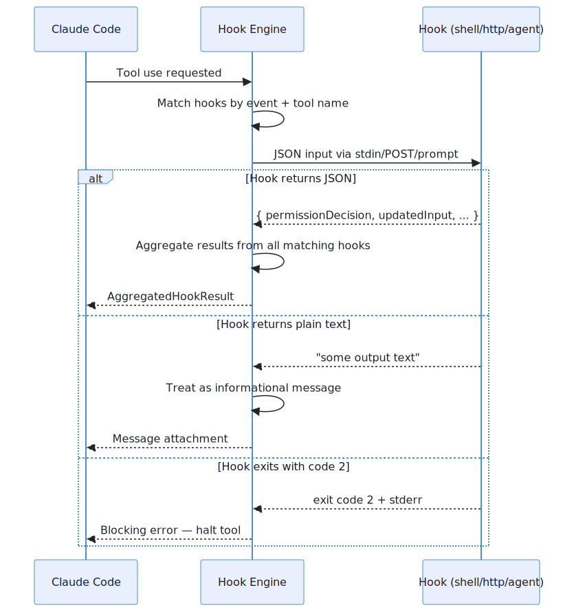

# 钩子系统 (Hook System)：20 种事件类型，全生命周期拦截

> 📚 本文档源自 [claude-reviews-claude](https://github.com/openedclaude/claude-reviews-claude) 项目，作为 Glaude 实现的参考分析。

> **源文件**：`utils/hooks.ts` (5,023 行), `utils/hooks/` 目录, `hooks/` 顶层目录 (17,931 行)

## 太长不看，一句话总结

Claude Code 拥有一个包含 20 种事件的钩子系统，允许用户和插件拦截几乎每一个动作 —— 从工具执行、会话生命周期到权限决策。钩子可以批准、拒绝、修改输入、注入上下文或停止整个会话。核心实现文件 (`hooks.ts`) 长达 **5,023 行** —— 这比许多完整的应用程序还要庞大。

---

## 1. 20 种钩子事件

<p align="center">
  
</p>

### 最重要的钩子：PreToolUse (工具使用前)

`PreToolUse` 在每次工具执行前触发。它可以：

| 动作 | JSON 输出形式 | 效果 |
|--------|-------------|--------|
| **允许** | `{ "permissionDecision": "allow" }` | 跳过权限提示，自动批准 |
| **拒绝** | `{ "permissionDecision": "deny" }` | 拦截工具，向模型返回错误 |
| **询问** | `{ "permissionDecision": "ask" }` | 强制弹出用户权限确认提示 |
| **修改输入** | `{ "updatedInput": {...} }` | 在执行前篡改工具参数 |
| **停止会话** | `{ "continue": false }` | 彻底叫停智能体循环 |

---

## 2. 钩子的执行架构

### 钩子类型

钩子可以通过四种方式实现：
1. **指令型 (Command)**：执行 shell 脚本（如 `python validate.py`）。
2. **HTTP 型**：发送 Webhook 请求到指定端点。
3. **智能体型 (Agent)**：调用另一个 Claude 子智能体作为审核者。
4. **函数型 (Function)**：仅在 SDK 模式下可用的进程内 JavaScript 回调。

### 执行流程

<p align="center">
  
</p>

1. 当发起工具使用请求时，引擎通过事件和工具名称匹配触发对应的钩子。
2. 钩子通过 stdin/POST/Prompt 接收含有上下文的 JSON 载荷。
3. 如果钩子返回合法的 JSON，引擎会对其解析并用于决定系统的行动（如修改输入或拦截）。
4. 如果钩子仅返回纯文本，它将被视作一条附加信息（Message attachment）。
5. **约定的退出码**：0 表示成功；1 表示非阻塞错误；**2 表示阻塞错误，将强行终止工具运行**。

---

## 3. 钩子的匹配机制

钩子在配置文件中声明其拦截领域：
```json
// 源码位置: src/utils/hooks.ts:156-170
{
  "hooks": {
    "PreToolUse": [
      {
        "matcher": "Bash(git *)",
        "command": "python validate_git.py"
      }
    ]
  }
}
```
匹配器 (matcher) 支持指定工具名（如 `Bash`），支持模式匹配（如 `Bash(git *)` 控制仅限 git 命令），甚至支持通配符 `*` 拦截所有工具。

对于权限匹配，系统采用了"闭包注入"模式，避免了每次匹配时重复解析工具输入。

---

## 4. JSON 协议机制

钩子通信依赖结构化的 JSON。
从系统传入钩子的 `stdin` 会包含 `session_id`、当前路径 `cwd`、工具名及输入的参数。
钩子输出的 `stdout` 除了包含 `continue` 和 `decision` 字段外，还可以利用 `hookSpecificOutput` 进行细粒度控制（例如注入系统消息，或篡改即将执行的命令）。为了系统稳定，输出结果会经过 Zod 的严格模式校验。

---

## 5. 工作区信任的安全性控制

**这是一个关键的安全防御点**：防止位于不受信任工作区的恶意代码执行权限篡改。
在交互式运行下（即 CLI 环境），只有当用户接受了工作区信任弹窗（`checkHasTrustDialogAccepted()` 为 true），钩子才被允许运行。这消除了通过 `.claude/settings.json` 隐藏后门执行任意代码的攻击载体。

---

## 6. 后台异步钩子与唤醒

钩子不仅可以同步拦截，还可以配置为**后台异步执行**：
当钩子返回 `{ "async": true, "asyncRewake": true }` 时，它将被挂起在后台运行。即使模型当前正在处理其他任务，当异步钩子完成时，它可以通过产生 `task-notification` 消息重新唤醒（Re-wake）模型，把数据强行注入到对话流中。

---

## 7. 钩子聚合策略 (Hook Aggregation)

当多个钩子同时匹配到同一个事件时，其结果会按特定策略聚合：
- **拒绝优先**："Deny" 的权重大于"Allow"（最严限制胜出）。
- **截断策略**：任何一个钩子包含 `preventContinuation` 就会导致对话中途停止。
- **最新覆盖**：多个钩子均尝试修改输入（`updatedInput`）时，最后一个生效。
- **上下文合并**：多条注入内容会被拼接。

这意味着某一个安全审核插件可以否决其他所有插件的宽松决定。

---

## 可迁移设计模式

> 以下模式可直接应用于其他 Agentic 系统或 CLI 工具。

### 模式 1：以退出码 (Exit Code) 作为控制流
对于跨语言调用的脚本系统来说，利用退出码（0/1/2）来区分"成功"、"警告"和"强硬拦截"是一种极简且普适的通信协议，无需特定的 SDK 支持。

### 模式 2：JSON 与文本的降级包容性
系统允许钩子返回严格的 JSON，也允许只返回一段随意的文本。JSON 会被用于逻辑控制，文本会被用作简单的日志附件。这种设计极大地降低了开发简单提示器（Hook）的门槛，同时不失对复杂控制能力的支持。

### 模式 3：匹配器闭包预编译
系统预先编译带有校验逻辑的闭包，避免了每次命中钩子时都要完整走一遍正则表达式或 AST 解析过程，优化了性能。

---

## 9. 总结

| 维度 | 细节 |
|--------|--------|
| **总代码量** | `hooks.ts` 中含 5,023 行，`hooks/` 目录含 17,931 行 |
| **事件种类** | 20 个生命周期钩子事件 |
| **触发方式** | Shell 命令行、Webhook HTTP、子智能体代理、JS 回调（SDK） |
| **关键拦截点** | `PreToolUse` —— 能审核、拒绝或篡改任何工具调用 |
| **安全机制** | 强制要求工作区信任 (Workspace Trust) |
| **异步流** | 支持后台执行，以及回调型模型唤醒 |
| **冲突聚合** | 按照"最严苛限制优先（Deny > Allow）"和覆盖原则合并结果 |
