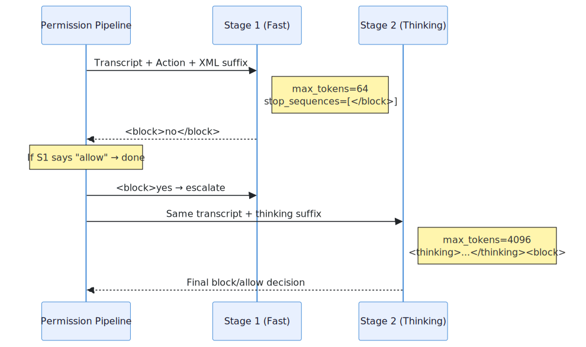

# 07 — 权限流水线：从规则到内核的纵深防御

> 📚 本文档源自 [claude-reviews-claude](https://github.com/openedclaude/claude-reviews-claude) 项目，作为 Glaude 实现的参考分析。


> **范围**: `utils/permissions/` (24 个文件, ~320KB), `utils/settings/` (17 个文件, ~135KB), `utils/sandbox/` (2 个文件, ~37KB)
>
> **一句话概括**: Claude Code 如何决定一个工具调用的生死 —— 经过规则、分类器、钩子和操作系统沙箱的七步考验。

---

## 架构概览

<p align="center">
  
</p>

---

## 1. 七步考验

核心函数 `hasPermissionsToUseToolInner()` 实现了一个**严格有序**的权限评估流水线。每一步都可以短路整个链条：

### 步骤 1a：工具级拒绝规则

硬拒绝 —— 无法覆盖。规则来源包括：`userSettings`、`projectSettings`、`localSettings`、`policySettings`、`flagSettings`、`cliArg`、`command`、`session`。

### 步骤 1b：工具级询问规则

关键设计：当沙箱启用并配置了自动允许时，沙箱化的 Bash 命令可以**跳过**询问规则。非沙箱化命令（被排除的命令、`dangerouslyDisableSandbox`）仍然遵守规则。

### 步骤 1c：工具内容级权限检查

每个工具实现自己的 `checkPermissions()`。BashTool 检查子命令，EditTool 检查文件路径，WebFetch 验证域名。

### 步骤 1d–1g：安全护栏

| 步骤 | 检查 | 能否被绕过？ |
|------|------|------------|
| **1d** | 工具实现拒绝 | ❌ 不能 |
| **1e** | `requiresUserInteraction()` 返回 true | ❌ 不能 |
| **1f** | 内容级询问规则（如 `Bash(npm publish:*)`） | ❌ 不能 |
| **1g** | 安全检查（`.git/`、`.claude/`、`.vscode/`、shell 配置） | ❌ 不能 |

这四项检查是**绕过免疫**的 —— 即使在 `bypassPermissions` 模式下也会触发。

### 步骤 2a：绕过权限模式

如果当前处于 `bypassPermissions` 模式（或 plan 模式但原始模式是 bypass），直接允许。

### 步骤 2b：始终允许规则

支持 MCP 服务器级匹配：规则 `mcp__server1` 匹配 `mcp__server1__tool1`。

### 步骤 3：Passthrough → Ask

如果没有任何决策，默认询问用户。

---

## 2. 六种权限模式

<p align="center">
  
</p>

| 模式 | `ask` 变为 | 安全检查 | 说明 |
|------|-----------|---------|------|
| `default` | 提示用户 | 提示 | 标准交互模式 |
| `plan` | 提示用户 | 提示 | 暂存前置模式以便恢复 |
| `acceptEdits` | 允许（仅文件编辑） | 提示 | 非编辑工具仍需提示 |
| `bypassPermissions` | 全部允许 | **仍然提示** | 可被 GrowthBook 门控或设置禁用 |
| `dontAsk` | **拒绝** | 提示 | 静默拒绝，模型看到拒绝消息 |
| `auto` | 分类器决策 | 提示 | 两阶段 XML 分类器，需门控 |

### 模式转换

`transitionPermissionMode()` 集中处理所有副作用：

- **进入 auto 模式**：剥离危险权限（`Bash(*)`、`python:*`、Agent 允许列表）—— 这些权限会绕过分类器
- **离开 auto 模式**：恢复被剥离的权限
- **进入 plan 模式**：保存前置模式以便恢复
- **离开 plan 模式**：恢复之前的模式

---

## 3. 规则来源与层级

规则从 **7 个来源**加载：

| 来源 | 文件 | 范围 |
|------|------|------|
| `userSettings` | `~/.claude/settings.json` | 用户全局 |
| `projectSettings` | `.claude/settings.json` | 项目级，提交到仓库 |
| `localSettings` | `.claude/settings.local.json` | 项目级，gitignore |
| `policySettings` | 企业 MDM 策略 | 组织范围 |
| `flagSettings` | GrowthBook 功能标志 | 远程配置 |
| `cliArg` | `--allowed-tools`、`--disallowed-tools` | 单次调用 |
| `session` | 运行时通过权限对话框添加 | 单次会话 |

### 规则格式

```
ToolName                  → 匹配整个工具
ToolName(content)         → 匹配带特定内容的工具
Bash(npm test:*)          → Bash 命令的前缀匹配
mcp__server1              → 匹配 MCP 服务器的所有工具
Agent(Explore)            → 匹配特定代理类型
```

---

## 4. YOLO 分类器（Auto 模式）

当模式为 `auto` 时，`ask` 决策经过**三级快速路径**系统后才到达 AI 分类器：

### 第一级：acceptEdits 快速路径

以 `acceptEdits` 模式重新运行 `tool.checkPermissions()`。如果允许，跳过分类器。例外：`AgentTool` 和 `REPLTool` 被排除 —— REPL 代码可能包含 VM 逃逸。

### 第二级：安全工具允许列表

列入允许名单的工具完全跳过分类器。

### 第三级：两阶段 XML 分类器

<p align="center">
  
</p>

分类器使用单独的 LLM API 调用（`sideQuery`）和专用系统提示词：

**阶段 1（快速）**：max_tokens=64，引导立即给出 `<block>yes/no`。如果允许 → 结束。

**阶段 2（思考）**：仅在阶段 1 阻止时运行。使用思维链减少误报。指令说明：*"审查分类过程... 覆盖阻止需要显式用户确认。"*

### 分类器看到什么

分类器看到的是**紧凑版记录** —— 不是完整对话：

```jsonl
{"user":"修复登录bug"}
{"Bash":"ls src/"}
{"Read":"src/auth.ts"}
{"Bash":"npm test"}     ← 正在被分类的操作
```

关键安全设计：**助手文本被排除** —— 仅包含 tool_use 区块。这防止模型构造影响分类器决策的诱导性文本。

### 危险权限剥离

进入 auto 模式时，会绕过分类器的权限被**剥离**：

- `Bash`（无内容）→ 允许所有命令
- `Bash(python:*)`、`Bash(node:*)` → 允许任意代码执行
- `PowerShell(iex:*)`、`PowerShell(Start-Process:*)` → 代码执行
- `Agent`（任何允许规则）→ 绕过子代理评估

被剥离的规则**暂存**到 `strippedDangerousRules`，离开 auto 模式时恢复。

---

## 5. 拒绝追踪与熔断器

### 连续拒绝限制

```typescript
// 源码位置: src/utils/permissions/denialTracking.ts:5-10
export const DENIAL_LIMITS = {
  maxConsecutive: 3,   // 连续 3 次阻止 → 回退到用户提示
  maxTotal: 20,        // 单次会话总计 20 次阻止 → 回退
}
```

超过限制时：
- **交互模式**：回退到用户提示
- **无头模式**：抛出 `AbortError` —— 会话终止

### 分类器故障模式

| 场景 | iron_gate = true（默认） | iron_gate = false |
|------|------------------------|-------------------|
| **API 错误** | 拒绝（失败关闭） | 回退到用户提示（失败开放） |
| **记录过长** | 无头时中止；交互时提示 | 相同 |
| **无法解析响应** | 视为阻止 | 相同 |

`tengu_iron_gate_closed` 功能标志控制失败时关闭 vs. 开放行为，每 30 分钟刷新。

---

## 6. 无头代理权限

后台/异步代理无法显示权限提示。流水线的处理方式：

1. 运行 `PermissionRequest` 钩子 —— 给钩子机会做出决策
2. 如果没有钩子决策 → 自动拒绝

钩子可以 `allow`（带可选输入修改）、`deny` 或 `interrupt`（中止整个代理）。

---

## 7. 沙箱集成

沙箱提供**内核级强制执行**，补充应用层权限流水线：

### 沙箱自动允许

当 `autoAllowBashIfSandboxed` 启用时：
1. 通过 `shouldUseSandbox()` 检查的 Bash 命令 → **自动允许**（跳过 ask 规则）
2. OS 沙箱强制执行文件系统和网络限制
3. 应用层检查对沙箱化操作变得冗余

### 沙箱保护范围

| 保护 | 实现 |
|------|------|
| 文件系统写入 | `denyWrite` 列表（设置文件、`.claude/skills`） |
| 文件系统读取 | `denyRead` 列表（敏感路径） |
| 网络访问 | 来自 WebFetch 规则的域名允许列表 |
| 裸 Git 仓库攻击 | 命令前后文件清扫 |
| 符号链接追踪 | `O_NOFOLLOW` 文件操作 |
| 设置逃逸 | 无条件拒绝写入 settings.json |

---

## 8. 完整决策流程

<p align="center">
  
</p>

---

## 可迁移设计模式

> 以下模式可直接应用于其他 AI 智能体权限系统或安全流水线。

### 模式 1：有序流水线 + 绕过免疫安全检查
**场景：** 不同规则源需要不同的覆盖语义。
**实践：** 将权限评估结构化为严格有序的流水线，其中某些步骤对所有绕过模式免疫。
**Claude Code 中的应用：** 步骤 1d-1g 即使在 `bypassPermissions` 模式下也会触发。

### 模式 2：分类器只看工具不看文本
**场景：** AI 安全分类器可能被模型自己的说服性输出影响。
**实践：** 从分类器输入中剥除助手文本，仅包含结构化 tool_use 区块。
**Claude Code 中的应用：** YOLO 分类器的记录排除助手文本，防止社会工程攻击。

### 模式 3：可逆权限剥离
**场景：** 进入高自动化模式不应永久破坏手动权限规则。
**实践：** 进入模式时暂存被剥离的规则，退出时恢复。
**Claude Code 中的应用：** 危险的 `Bash(*)` 规则在进入 auto 模式时暂存，退出时恢复。

### 模式 4：拒绝熔断器
**场景：** 被阻止的操作导致无限重试循环。
**实践：** 追踪连续和总计拒绝次数，超限后触发回退。
**Claude Code 中的应用：** 连续 3 次或总计 20 次拒绝触发模式回退。

---

## 10. OAuth 2.0 认证管道

**源码坐标**: `src/services/oauth/client.ts`、`src/auth/`

权限系统的权威性始于身份验证。Claude Code 支持两条认证路径：

| 路径 | 方法 | Token 类型 |
|------|------|-----------|
| **Console API Key** | `ANTHROPIC_API_KEY` 环境变量或配置 | 静态密钥，无过期管理 |
| **Claude.ai OAuth** | PKCE 授权码流程 | JWT + 刷新，~1h 过期 |

关键安全属性：
- **PKCE (S256)**：防止授权码拦截 —— `code_verifier` 在客户端生成，直到交换时才发送
- **Token 生命周期**：Access token ~1h 过期；Refresh token 存储在 SecureStorage 中，自动在过期前刷新
- **撤销处理**：过期/已撤销的 token 触发重新认证，而非静默失败

### Token 刷新调度

Bridge 会话使用 generation counter（代数计数器）防止过期刷新竞态，在过期前 5 分钟调度刷新，失败最多重试 3 次。

---

## 11. Settings 多源合并系统

**源码坐标**: `src/utils/settings/settings.ts`、`src/utils/settings/constants.ts`

权限规则从五层设置系统加载（详见第 16 篇），但权限相关的特殊方面值得在此说明。

### 企业管控权限

企业策略设置（`policySettings`）具有特殊属性：它们**无法被**低优先级来源覆盖。当策略拒绝某工具时，任何项目或用户设置都无法重新允许它。

### `disableBypassPermissionsMode` 设置

企业部署可以完全禁用绕过模式：

```typescript
permissions: {
  disableBypassPermissionsMode: 'disable',  // 完全移除该选项
  deny: [
    { tool: 'Bash', content: 'rm -rf:*' },  // 策略级拒绝
  ]
}
```

---

## 12. 安全凭证存储

**源码坐标**: `src/utils/secureStorage/`

### 平台适配链

macOS 通过 `security` CLI 使用原生 Keychain，其他平台优雅降级到明文存储。

### Stale-While-Error 策略

凭证存储韧性的最重要模式：当 `security` 子进程失败时，继续使用缓存的成功数据而非返回 null。如果没有这一策略，macOS Keychain Service 的临时重启会导致所有进行中的请求以"未登录"失败。

### 4096 字节 stdin 限制

macOS `security` 命令有一个未文档化的 stdin 限制（4096 字节）。超过此限制会导致**静默数据截断** → 凭证损坏。这迫使设计选择最小化存储的凭证大小。

---

## 13. 组件总结

| 组件 | 行数 | 角色 |
|------|------|------|
| `permissions.ts` | 1,487 | 核心流水线：7步评估、模式变换 |
| `permissionSetup.ts` | 1,533 | 模式初始化、危险权限检测 |
| `yoloClassifier.ts` | 1,496 | auto 模式的两阶段 XML 分类器 |
| `PermissionMode.ts` | 142 | 6种权限模式 + 配置 |
| `PermissionRule.ts` | 41 | 规则类型：`{toolName, ruleContent?}` |
| `denialTracking.ts` | 46 | 熔断器：连续 3 次 / 总计 20 次 |
| `permissionRuleParser.ts` | ~200 | 规则字符串 ↔ 结构化值转换 |
| `permissionsLoader.ts` | ~250 | 从 7 个设置来源加载规则 |
| `shadowedRuleDetection.ts` | ~250 | 检测冲突/遮蔽的规则 |
| `sandbox-adapter.ts` | 986 | OS 沙箱：seatbelt / bubblewrap |

权限流水线是 Claude Code 架构最精密的子系统。其七步评估顺序 —— 包含四项绕过免疫的安全检查 —— 代表了关于 AI 代理执行任意代码时可能发生什么的血泪教训。YOLO 分类器的引入展示了系统从纯规则匹配向 AI 辅助安全决策的演进，同时保留确定性护栏作为安全网。

---

---

## 设计哲学

> 以下内容提炼自设计深潜系列，阐述权限与安全模型背后的设计理念。

### Permission Mode 不是开关，而是治理姿态

不同模式定义的是系统当前采取什么治理姿态：default 是逐次裁决、plan 是先讨论后执行、acceptEdits 是局部白名单化、bypassPermissions 是高度信任、auto 是分类器代行部分决策。Claude Code 承认不存在一种永远正确的默认安全策略，把"怎么治理"本身暴露成运行时制度。

### 规则系统的关键不在 allow，而在冲突处理

权限系统面对的不是一张规则表，而是多层权威叠加的政治现场（user/project/local/flag/policy settings）。deny 是否压过 allow、ask 是否强制打断已有 allow、共享设置和个人设置谁说了算——最见成熟度的一点是它会显式分析 shadowed rule。**一套不可解释的权限系统，迟早会被用户绕过。**

### 规则、Hook、分类器三层各有职责

- **规则层**解决"已知结构化事实"：Edit(.claude/*) 是否允许、Bash(git status) 是否放行
- **Hook 层**解决"组织特定策略"：企业或团队注入自定义审批逻辑
- **分类器层**解决"结构化规则覆盖不了，但又不值得每次都问人"的灰区

三层形成完整治理链：明确规则先裁 → 组织策略再裁 → 模糊灰区交给模型辅助裁 → 仍不确定时再问人。

### 不只在乎"工具名"，更在乎"落点"

同一个写文件动作，风险可能天差地别（改业务文件 vs 改 .ssh vs 改系统目录）。真正危险的不是"写文件"这个抽象动作，而是**"写到了哪里"**。动作类型是第一层风险，目标资源是第二层风险。

### "软硬兼施"的安全模型

硬力量：deny/ask/allow 规则、path validation、sandbox、mode gating、worktree 隔离。
软力量：system prompt 工具规范、auto classifier 风险判断、Hook 自然语言拒绝理由、UI 动作展示。

Agent 系统必须既靠制度约束，也靠行为引导。只有 prompt 没有权限会乱执行；只有权限没有 prompt 会频繁走到错误边界再被硬拦。

### 核心原理

不要试图用单一机制解决 agent 风险，而要把"可做""可在此处做""现在是否该做""是否需要额外确认"**拆开治理**。大模型代理的风险不是单点漏洞，而是跨层耦合风险，所以有效的防线也必须是分层的。
