# 08 — Swarm 智能体：多智能体团队协调

> 📚 本文档源自 [claude-reviews-claude](https://github.com/openedclaude/claude-reviews-claude) 项目，作为 Glaude 实现的参考分析。


> **范围**: `tools/TeamCreateTool/`、`tools/SendMessageTool/`、`tools/shared/spawnMultiAgent.ts`、`utils/swarm/`（~30 个文件，~6.8 千行）、`utils/teammateMailbox.ts`（1,184 行）
>
> **一句话概括**: Claude Code 如何在 tmux 窗格、iTerm2 分屏或进程内生成并行队友 —— 全部通过基于文件的邮箱系统配合锁文件并发控制进行协调。

---

## 架构概览

<p align="center">
  
</p>

---

## 1. 团队生命周期

### 创建团队

`TeamCreateTool` 初始化团队基础设施：

1. 生成唯一团队名（冲突时使用随机词组合）
2. 创建团队领导条目，确定性 agent ID：`team-lead@{teamName}`
3. 将 `config.json` 写入 `~/.claude/teams/{team-name}/`
4. 注册会话清理（退出时自动删除，除非已显式删除）
5. 重置任务列表目录，从编号 1 开始

### 生成队友

`spawnMultiAgent.ts`（1,094 行）处理完整的生成流程：

1. **解析模型**：`inherit` → 领导的模型；`undefined` → 硬编码回退
2. **生成唯一名称**：检查现有成员，追加 `-2`、`-3` 等
3. **检测后端**：tmux > iTerm2 > 进程内（见 §3）
4. **创建窗格/进程**：后端特定的生成逻辑
5. **构建 CLI 参数**：传播 `--agent-id`、`--team-name`、`--agent-color`、`--permission-mode`
6. **注册到团队文件**：将成员条目添加到 `config.json`
7. **发送初始消息**：将提示词写入队友的邮箱
8. **注册后台任务**：用于 UI 任务标识显示

---

## 2. 邮箱系统

智能体间通信的骨干是**基于文件的邮箱**，配合锁文件并发控制。

### 目录结构

```
~/.claude/teams/{team-name}/
├── config.json              # 团队清单
└── inboxes/
    ├── team-lead.json       # 领导的收件箱
    ├── researcher.json      # 队友收件箱
    └── test-runner.json     # 队友收件箱
```

### 消息类型

| 类型 | 方向 | 用途 |
|------|------|------|
| 纯文本私信 | 任意 → 任意 | 直接消息 |
| 广播（`to: "*"`） | 领导 → 全体 | 团队公告 |
| `idle_notification` | 工人 → 领导 | "我完成了/被阻塞了/失败了" |
| `permission_request` | 工人 → 领导 | 工具权限委托 |
| `permission_response` | 领导 → 工人 | 权限授予/拒绝 |
| `sandbox_permission_request` | 工人 → 领导 | 网络访问审批 |
| `plan_approval_request` | 工人 → 领导 | 计划审查（planModeRequired） |
| `shutdown_request` | 领导 → 工人 | 优雅关闭 |
| `shutdown_approved/rejected` | 工人 → 领导 | 关闭确认 |

### 并发控制

多个 Claude 实例可以并发写入 —— 锁文件通过指数退避重试（10 次重试，5-100ms 超时）序列化访问。

---

## 3. 后端检测与执行

三种后端决定队友的物理运行方式：

<p align="center">
  
</p>

| 特性 | Tmux | iTerm2 | 进程内 |
|------|------|--------|--------|
| 隔离性 | 独立进程 | 独立进程 | 同进程，独立查询循环 |
| UI 可见性 | 带彩色边框的窗格 | 原生 iTerm2 窗格 | 后台任务标识 |
| 前置条件 | tmux 已安装 | `it2` CLI 已安装 | 无 |
| 非交互模式（`-p`） | ❌ | ❌ | ✅（强制） |
| Socket 隔离 | PID 作用域：`claude-swarm-{pid}` | N/A | N/A |

检测优先级：**tmux 内部 → iTerm2 原生 → tmux 外部 → 进程内回退**。

---

## 4. 权限委托

队友没有交互终端 —— 它们将权限决策委托给领导：

1. 工人需要权限 → 创建 `permission_request` 消息
2. 写入领导的邮箱
3. 领导的 `useInboxPoller` 拾取请求
4. 领导向用户显示权限提示
5. 领导发送 `permission_response` 回工人的邮箱
6. 工人轮询收件箱，获取响应，继续或中止

### Plan Mode Required

带 `plan_mode_required: true` 生成的队友：
- 必须进入 plan 模式并创建计划
- 计划作为 `plan_approval_request` 发送给领导
- 领导审核后发送 `plan_approval_response`
- 批准时，领导的权限模式被继承（`plan` 映射为 `default`）

---

## 5. 智能体身份系统

```
格式：{name}@{teamName}
示例：researcher@my-project、team-lead@my-project
```

### CLI 标志传播

生成队友时，领导传播以下标志：

| 标志 | 条件 | 用途 |
|------|------|------|
| `--dangerously-skip-permissions` | bypass 模式 + 非 planModeRequired | 继承权限绕过 |
| `--permission-mode auto` | auto 模式 | 继承分类器 |
| `--model {model}` | 显式模型覆盖 | 使用领导的模型 |
| `--settings {path}` | CLI 设置路径 | 共享设置 |
| `--plugin-dir {dir}` | 内联插件 | 共享插件 |
| `--parent-session-id {id}` | 始终 | 血统追踪 |

---

## 6. 团队清理

### 优雅关闭

`SendMessage(type: shutdown_request)` → 队友回应 `shutdown_approved/rejected`：
- **批准**：进程内队友中止查询循环；窗格队友调用 `gracefulShutdown(0)`
- **拒绝**：队友提供原因，继续工作

### 会话清理

`cleanupSessionTeams()` 在领导退出时运行：
1. 终止孤立的队友窗格
2. 删除团队目录：`~/.claude/teams/{team-name}/`
3. 删除任务目录：`~/.claude/tasks/{team-name}/`
4. 销毁为隔离队友创建的 git worktree

---

## 可迁移设计模式

> 以下来自 Swarm 系统的模式可直接应用于任何多智能体或分布式协调架构。

### 为什么用文件邮箱？

邮箱系统使用纯 JSON 文件 + 锁文件，而非 IPC、WebSocket 或共享内存：
- **跨进程**：tmux 窗格是独立进程，没有共享内存
- **崩溃安全**：消息持久化在磁盘上，即使队友崩溃也不丢失
- **可调试**：`cat ~/.claude/teams/my-team/inboxes/researcher.json`
- **简单**：无守护进程，无端口分配，无服务发现

### 一个领导，多个工人

架构强制执行严格的领导-工人层级：
- 每个领导会话只能有一个团队
- 工人不能创建团队或批准自己的计划
- 关闭始终由领导发起，工人确认
- 权限委托始终是 工人 → 领导 → 工人

---

## 8. 协调器模式

**源码坐标**: `src/coordinator/coordinatorMode.ts`

协调器模式将领导从任务分发者转变为**综合引擎** —— 它不仅仅是委派工作，还要理解和整合结果。

### 激活：双重门控

构建时特性标志 AND 运行时环境变量必须同时启用。恢复会话时，`matchSessionMode()` 自动翻转变量以匹配恢复会话的模式。

### 协调器工作流

```
研究（工人，并行）→ 综合（协调器整合发现）→ 实现（工人，按文件集串行）→ 验证（工人，并行）
```

核心原则：
- **协调器拥有综合权** —— 不做"基于你的发现"式委派；协调器必须理解并重述
- **并行是超能力** —— 独立工人并发运行
- **读写隔离** —— 研究任务并行，写操作按文件集串行

---

## 9. 任务类型联合（7 种变体）

**源码坐标**: `src/tasks/`

每个后台任务由七种状态变体之一表示：

```typescript
export type TaskState =
  | LocalShellTaskState         // 本地 shell 命令
  | LocalAgentTaskState         // 通过 AgentTool 的子代理
  | RemoteAgentTaskState        // 远程 CCR 代理
  | InProcessTeammateTaskState  // 同进程团队成员
  | LocalWorkflowTaskState      // 本地工作流
  | MonitorMcpTaskState         // MCP 服务器监控
  | DreamTaskState              // 自动记忆整理
```

### 完成通知

代理完成时注入 `<task-notification>` XML，包含 `task-id`、`status`（completed/failed/killed）、`result`（最终文本响应）和 `usage` 统计。因为作为 `user` 类型消息注入，LLM 在对话流中自然处理它。

---

## 10. Agent 间通信协议

**源码坐标**: `src/tools/SendMessageTool/`

### 结构化消息类型

除纯文本外，代理可以交换带类型的控制消息：`shutdown_request`、`shutdown_response`、`plan_approval_response`。

### 消息路由

```
SendMessage(to="researcher", message="...")
  ↓
进程内队友？ → 直接 pendingMessages
  ↓ 否
本地代理？ → queuePendingMessage → 在工具轮次边界消费
  ↓ 否
窗格（tmux/iterm2）？ → 文件系统邮箱
  ↓ 否
UDS/Bridge？ → socket/bridge 传输
  ↓ 否
"*"（广播）？ → 遍历所有团队成员，逐个发送
```

### 跨会话通信（UDS）

启用 `feature('UDS_INBOX')` 时，同一机器上的 Claude Code 会话可通过 Unix Domain Socket 通信。消息封装为 `<cross-session-message>` XML。

---

## 11. DreamTask 与 UltraPlan

### DreamTask：自动记忆整理

DreamTask 运行后台代理，审查近期会话历史并将学习成果整理到 `MEMORY.md`。`priorMtime` 字段充当回滚锁 —— 如果整理在写入过程中被终止，系统可以恢复文件到整理前的状态。

### UltraPlan：编排式远程执行

UltraPlan 将代理范式扩展到通过 CCR（Claude Code Runner）的远程执行，实现"先规划-后执行"的工作流：远程生成计划，必须经过用户审批后才能开始实施。

---

## 组件总结

| 组件 | 行数 | 角色 |
|------|------|------|
| `spawnMultiAgent.ts` | 1,094 | 统一的队友生成逻辑 |
| `teammateMailbox.ts` | 1,184 | 基于文件的邮箱 + 锁文件并发 |
| `teamHelpers.ts` | 684 | 团队文件 CRUD、清理、worktree 管理 |
| `SendMessageTool.ts` | 918 | 私信、广播、关闭、计划审批 |
| `TeamCreateTool.ts` | 241 | 团队初始化 |
| `backends/registry.ts` | 465 | 后端检测：tmux > iTerm2 > 进程内 |
| `teammateLayoutManager.ts` | ~400 | 窗格创建、颜色分配、边框状态 |

Swarm 系统是 Claude Code 操作最复杂的功能 —— 它将进程管理、基于文件的 IPC、终端多路复用和分布式权限委托融合为一个多智能体框架。文件邮箱设计优先考虑简单性和可调试性而非性能，这在"分布式系统"实际上是共享同一文件系统的多个 AI 智能体时是正确的权衡。

---

---

## 设计哲学

> 以下内容提炼自设计深潜系列，阐述多智能体协作背后的设计理念。

### 多智能体核心不在"多"，而在"隔离"

真正难的不是把更多 agent 跑起来，而是让它们在共享任务目标的同时，不把彼此的上下文、权限、输出和生命周期搅成一锅粥。

引入 subagent、teammate、coordinator 不是因为主模型不能干活，而是因为复杂软件任务有明显的**认知拆分价值**：降低单个上下文的认知拥塞，把一个大上下文拆成多个小工作记忆。

### Fork 路径的高明：继承心智，但不继承自由

fork child 必须吃到与父级尽可能字节一致的请求前缀，以便最大化 prompt cache 命中。同时被强行灌入极强的行为约束。

Fork 的本质是：**继承认知，剥离自治**。上下文继承不是语义问题，而是成本问题——Claude Code 已经把"多智能体上下文复制"做成了可工程优化的对象。

### 扁平 roster 是有意为之

不允许任意层级的 team 嵌套，因为一旦允许就面对：责任链不清、汇报目标不清、UI 归属不清、权限审批冒泡不清、终止回收不清。宁可牺牲表达能力，也要换可解释性和可回收性。多智能体编排的复杂度，首先是**组织复杂度**，不是调用复杂度。

### In-process teammate：聪明的保守

不一味追求最强隔离，而是在"隔离成本"和"交互成本"之间找平衡。用 AsyncLocalStorage 维持上下文隔离，对大量短平快的研究型子任务来说成本收益比很高。**隔离等级和任务类型绑定**。

### Worktree 隔离：多智能体冲突最容易发生在文件系统层

两个 agent 即便上下文完全隔离，只要在同一份工作树里改文件就会相互踩踏。worktree 是给 agent 增加"物理隔离"。完成后按效果回收——没改动就清理，有改动就保留给后续 review/merge/resume。

### Coordinator 模式：更少亲自干活的 agent

正常模式下主 agent 既思考也执行；coordinator 模式下主 agent 更像调度者。规模一大，领导者最值钱的不是执行，而是**约束和综合**。

### 多智能体最贵的不是启动，而是收尾

任何多智能体系统如果只重视 spawn 而不重视回收、汇报、可见性和后续接续，就会快速退化成一堆悬空任务。Claude Code 把善后也当成主流程。

### 核心原理

把"并发干活"翻译成"受约束的可汇报工作单元"：用 fork 复制认知连续性，用 prompt 约束子 agent 行为边界，用 ALS/process/worktree 提供不同等级的隔离，用任务状态、消息路由和结果元数据维持可见性与回收能力。
