# 09 — 会话持久化：对话存储与恢复

> 📚 本文档源自 [claude-reviews-claude](https://github.com/openedclaude/claude-reviews-claude) 项目，作为 Glaude 实现的参考分析。


> **范围**: `utils/sessionStorage.ts`（5,106 行）、`utils/sessionStoragePortable.ts`（794 行）、`utils/sessionRestore.ts`（552 行）、`utils/conversationRecovery.ts`（598 行）、`utils/listSessionsImpl.ts`（455 行）、`utils/crossProjectResume.ts`（76 行）— 总计约 7,600 行
>
> **一句话概括**: Claude Code 如何将每一轮对话、元数据条目和子智能体转录持久化到仅追加的 JSONL 文件中 —— 并在 `--resume` 时通过 parent-UUID 链式遍历重建对话状态。

---

## 架构概览

<p align="center">
  
</p>

---

## 1. 存储格式：仅追加 JSONL

每个会话产生一个 JSONL 文件，路径为：

```
~/.claude/projects/{净化后的cwd}/{session-id}.jsonl
```

### 路径净化

`sanitizePath()` 将所有非字母数字字符替换为短横线。超过 200 字符的路径会追加哈希后缀以确保唯一性（Bun 使用 `Bun.hash`，Node 回退到 `djb2Hash`）。

### 条目类型

每一行是一个自包含的 JSON 对象，带有 `type` 字段：

| 类型 | 用途 |
|------|------|
| `user` / `assistant` / `system` / `attachment` | 转录消息（对话链） |
| `summary` | 压缩摘要 |
| `custom-title` / `ai-title` | 会话命名 |
| `last-prompt` | 最近一条用户提示（用于 `--resume` 选择器） |
| `tag` | 用户定义的会话标签 |
| `agent-name` / `agent-color` / `agent-setting` | 独立智能体上下文 |
| `mode` | `coordinator` 或 `normal` |
| `worktree-state` | Git worktree 进入/退出追踪 |
| `pr-link` | GitHub PR 关联 |
| `file-history-snapshot` | 文件修改历史追踪 |
| `attribution-snapshot` | 提交归因状态 |
| `content-replacement` | 工具输出压缩记录 |
| `marble-origami-commit` / `marble-origami-snapshot` | 上下文折叠状态 |
| `queue-operation` | 消息队列操作 |

### Parent-UUID 链

转录消息通过 `parentUuid` → `uuid` 形成链表结构：

```
msg-A (parentUuid: null)
  └── msg-B (parentUuid: A)
        └── msg-C (parentUuid: B)
              └── msg-D (parentUuid: C)
```

这种设计支持分支（fork 会话共享链前缀）、侧链（子智能体转录）和压缩边界（null parentUuid 截断链条）。

---

## 2. Project 单例

`sessionStorage.ts` 的核心是 `Project` 类 —— 一个进程生命周期的单例，管理所有写入操作。

### 延迟实体化

会话文件不会在启动时创建，而是在**首条用户或助手消息**时实体化：

1. 消息前的条目（钩子输出、附件）缓冲在 `pendingEntries[]` 中
2. `materializeSessionFile()` 创建文件、写入缓存的元数据、刷新缓冲区
3. 这避免了启动即退出场景下产生孤立的纯元数据文件

### 双写入路径

系统有**两套独立的写入机制**，适用于不同场景：

| 路径 | 方法 | 使用场景 |
|------|------|---------|
| **异步队列** | `Project.enqueueWrite()` → `scheduleDrain()` → `drainWriteQueue()` | 正常运行时 — 所有转录消息 |
| **同步直写** | `appendEntryToFile()` → `appendFileSync()` | 退出清理、元数据重追加、`saveCustomTitle()` |

异步队列是正常运行时的主写入路径：

```
Project.appendEntry() → enqueueWrite(filePath, entry)
                            │
                            ▼
                      scheduleDrain()
                            │
                            ▼ (100ms 定时器，CCR 模式下 10ms)
                      drainWriteQueue()
                            │
                            ▼
                      appendToFile() → fsAppendFile(path, data, { mode: 0o600 })
```

同步路径（`appendEntryToFile`）完全绕过队列 — 使用 `appendFileSync` 处理异步调度不安全的场景（进程退出处理器、`reAppendSessionMetadata`）。

关键设计决策：

- **按文件分队列**：`Map<string, Array<{entry, resolve}>>` —— 子智能体转录写入独立文件
- **100ms 合并窗口**：将快速连续写入批量合并为单次 `appendFile` 调用
- **100MB 分块上限**：防止单次 `write()` 系统调用超过 OS 限制
- **写入追踪**：`pendingWriteCount` + `flushResolvers` 确保关闭前的可靠 `flush()`

### UUID 去重

写入前，`appendEntry()` 检查 UUID 是否已存在于 `getSessionMessages()` 中：

```typescript
const isNewUuid = !messageSet.has(entry.uuid)
if (isAgentSidechain || isNewUuid) {
  void this.enqueueWrite(targetFile, entry)
}
```

智能体侧链条目跳过此检查 —— 它们写入独立文件，且 fork 继承的父消息与主转录共享 UUID。

---

## 3. 恢复：从 JSONL 到对话

### 恢复流水线

```
loadConversationForResume(source)
  │
  ├── source === undefined  → loadMessageLogs() → 最近会话
  ├── source === string     → getLastSessionLog(sessionId)
  └── source === .jsonl 路径 → loadMessagesFromJsonlPath()
        │
        ▼
  loadTranscriptFile(path)
        │
        ▼
  readTranscriptForLoad(filePath, fileSize)    ← 分块读取，剥离属性快照
        │
        ▼
  parseJSONL → Map<UUID, TranscriptMessage>
        │
        ▼
  applyPreservedSegmentRelinks()    ← 压缩后重连保留段
  applySnipRemovals()               ← 删除 snip 移除的消息，重连链条
        │
        ▼
  findLatestMessage(leafUuids)      ← 最新的非侧链叶节点
        │
        ▼
  buildConversationChain(messages, leaf)  ← 沿 parentUuid 遍历至根，反转
        │
        ▼
  recoverOrphanedParallelToolResults()   ← 恢复被遗漏的并行 tool_use 兄弟节点
        │
        ▼
  deserializeMessagesWithInterruptDetection()
        │
        ├── filterUnresolvedToolUses()
        ├── filterOrphanedThinkingOnlyMessages()
        ├── filterWhitespaceOnlyAssistantMessages()
        ├── detectTurnInterruption()
        └── 如果中断则追加合成的继续消息
```

### 链式遍历

`buildConversationChain()` 是核心遍历算法：

```typescript
let currentMsg = leafMessage
while (currentMsg) {
  if (seen.has(currentMsg.uuid)) break  // 环检测
  seen.add(currentMsg.uuid)
  transcript.push(currentMsg)
  currentMsg = currentMsg.parentUuid
    ? messages.get(currentMsg.parentUuid)
    : undefined
}
transcript.reverse()
```

从叶节点遍历到根节点，然后反转 —— 生成按时间顺序排列的对话。`seen` 集合防止损坏的链指针导致无限循环。

### 恢复一致性检查

链重建完成后，`checkResumeConsistency()` 将链长度与最近的 `turn_duration` 检查点记录的 `messageCount` 进行比对：

- **delta > 0**：恢复加载了比实际会话更多的消息（常见失败模式 — snip/compact 变更未反映在 parentUuid 链中）
- **delta < 0**：恢复加载了更少的消息（链截断）
- **delta = 0**：往返一致

该检查在每次恢复时触发一次，并将结果发送到 BigQuery 监控，用于检测 write→load 漂移。

### 中断检测

`detectTurnInterruption()` 判断上次会话是否在轮次中被中断：

| 最后消息类型 | 状态 | 动作 |
|-------------|------|------|
| 助手消息 | 轮次完成 | `none` |
| 用户消息（tool_result） | 工具执行中 | `interrupted_turn` → 注入"继续" |
| 用户消息（文本） | 提示未获响应 | `interrupted_prompt` |
| 附件 | 提供了上下文但无响应 | `interrupted_turn` |

---

## 4. 轻量元数据：64KB 窗口

对于 `--resume` 会话选择器，读取完整 JSONL 文件过于缓慢。**轻量路径**只读取头部和尾部各 64KB：

```typescript
export const LITE_READ_BUF_SIZE = 65536

async function readHeadAndTail(filePath, fileSize, buf) {
  const head = await fh.read(buf, 0, LITE_READ_BUF_SIZE, 0)
  const tailOffset = Math.max(0, fileSize - LITE_READ_BUF_SIZE)
  const tail = tailOffset > 0
    ? await fh.read(buf, 0, LITE_READ_BUF_SIZE, tailOffset)
    : head
  return { head, tail }
}
```

### 提取内容

从**头部**提取：`firstPrompt`、`createdAt`、`cwd`、`gitBranch`、`sessionId`、侧链检测

从**尾部**提取：`customTitle`、`aiTitle`、`lastPrompt`、`tag`、`summary`

### 重追加策略

问题：随着会话增长，元数据条目（标题、标签）会被推出 64KB 尾部窗口。

解决方案：`reAppendSessionMetadata()` 在 EOF 重新写入所有元数据条目：
- 压缩期间（在边界标记之前）
- 会话退出时（清理处理器）
- `--resume` 接管文件后

这确保 `--resume` 始终能在尾部窗口中找到元数据。

---

## 5. 多层级转录层次

```
~/.claude/projects/{hash}/
├── {session-id}.jsonl                        # 主转录
├── {session-id}/
│   ├── subagents/
│   │   ├── agent-{agent-id}.jsonl            # 子智能体转录
│   │   ├── agent-{agent-id}.meta.json        # 智能体类型 + worktree 路径
│   │   └── workflows/{run-id}/
│   │       └── agent-{agent-id}.jsonl        # 工作流智能体转录
│   └── remote-agents/
│       └── remote-agent-{task-id}.meta.json  # CCR 远程智能体元数据
```

### 会话与子智能体隔离

- 主线程消息 → `{session-id}.jsonl`
- 带 `agentId` 的侧链消息 → `agent-{agentId}.jsonl`
- 内容替换条目遵循相同的路由规则

这种隔离使得子智能体对话可以独立恢复，无需加载整个主转录。

---

## 6. 跨项目与 Worktree 恢复

会话按项目目录隔离。跨项目恢复需要：

1. **同仓库 worktree**：直接恢复 —— `switchSession()` 指向 worktree 项目目录下的转录文件
2. **不同仓库**：生成 `cd {path} && claude --resume {id}` 命令

`resolveSessionFilePath()` 搜索顺序：
1. 精确项目目录匹配
2. 哈希不匹配降级（Bun 与 Node 对 > 200 字符路径的哈希差异）
3. 兄弟 worktree 目录

---

## 7. 远程持久化

两种服务端存储路径：

### v1：Session Ingress
```typescript
if (isEnvTruthy(process.env.ENABLE_SESSION_PERSISTENCE) && this.remoteIngressUrl) {
  await sessionIngress.appendSessionLog(sessionId, entry, this.remoteIngressUrl)
}
```

### v2：CCR 内部事件
```typescript
if (this.internalEventWriter) {
  await this.internalEventWriter('transcript', entry, { isCompaction, agentId })
}
```

两条路径都在本地持久化之后触发。v1 路径上的失败会触发 `gracefulShutdownSync(1)` —— 会话不能在本地/远程状态分离的情况下继续。

---

## 8. 会话列表优化

`listSessionsImpl()` 使用两阶段策略：

### 第一阶段：Stat 扫描（设置了 limit/offset 时）
```
readdir(projectDir) → 过滤 .jsonl → 逐个 stat → 按 mtime 降序排序
```
约 1000 次 stat，无内容读取。

### 第二阶段：内容读取（仅前 N 个）
```
readSessionLite(filePath) → parseSessionInfoFromLite() → 过滤侧链
```
`limit: 20` 时约 20 次内容读取。

### 无 Limit 时
完全跳过 stat 阶段 —— 读取所有候选项，按 lite-read 的 mtime 排序。I/O 开销与全部读取相同，但避免了额外的 stat 调用。

---

## 可迁移设计模式

> 以下模式可直接应用于其他持久化日志系统或 CLI 状态管理。

### 模式 1：仅追加 JSONL 实现崩溃安全
**场景：** 进程崩溃不能损坏已持久化的数据。
**实践：** 每条条目作为自包含 JSON 行写入；重新加载时简单忽略不完整的末尾行。
**Claude Code 中的应用：** 会话转录使用仅追加 JSONL，正常操作期间无需整文件重写。

### 模式 2：64KB 头尾窗口实现快速元数据
**场景：** 列出数千个会话文件需要元数据但不能全量反序列化。
**实践：** 只读取每个文件的头尾各 64KB；将元数据条目重追加到 EOF 以保持在尾部窗口内。
**Claude Code 中的应用：** `readHeadAndTail()` 从 64KB 切片中提取标题、提示和时间戳。

### 模式 3：Parent-UUID 链实现分支历史
**场景：** 对话可以分叉（子智能体）或压缩（截断），但仍需可恢复。
**实践：** 每条消息携带 `uuid` 和 `parentUuid`，形成链表，支持分支和压缩边界。
**Claude Code 中的应用：** `buildConversationChain()` 从叶节点遍历到根节点然后反转。

---

## 组件总结

| 组件 | 行数 | 角色 |
|------|------|------|
| `sessionStorage.ts` | 5,106 | 核心持久化：Project 类、写入队列、链式遍历、元数据 |
| `sessionStoragePortable.ts` | 794 | 共享工具：路径净化、头/尾读取、分块转录读取器 |
| `conversationRecovery.ts` | 598 | 恢复流水线：反序列化、中断检测、技能状态恢复 |
| `sessionRestore.ts` | 552 | 状态重建：worktree、智能体、模式、归因、待办事项 |
| `listSessionsImpl.ts` | 455 | 会话列表：stat/读取两阶段、worktree 扫描、分页 |
| `crossProjectResume.ts` | 76 | 跨项目检测与命令生成 |

会话持久化系统是 Claude Code 的机构记忆 —— 一个精心优化的仅追加日志，在崩溃安全、恢复速度和存储效率之间取得平衡。64KB 轻量读取窗口、parent-UUID 链式遍历和延迟实体化，都是对真实世界扩展压力的响应：会话增长到数 GB、用户拥有数千个会话、以及崩溃恢复要求零数据丢失。

---

## 设计哲学

> 以下内容提炼自设计深潜系列，阐述持久化与记忆系统背后的设计理念。

### 记忆系统的核心不是记住，而是分层遗忘

不同信息处于不同时间尺度：当前正在编辑的文件是分钟级事实、项目用 bun 不是 npm 是会话级事实、用户偏好是长期协作事实。全部塞进上下文的结果：短期上下文被长期事实占满，长期事实又因为压缩不断遗失。

### 四类 memory 的闭合分类是最重要的约束

user、feedback、project、reference——更重要的是它**排除**了什么：代码结构、架构、git history、文件路径、谁改了什么。真正宝贵的 memory 不是"当前项目事实的副本"，而是无法从仓库当前状态可靠反推出来的协作事实。没有这条边界，memory 会迅速退化成过期索引库。

### MEMORY.md 不是记忆，而是记忆索引

模型每轮都要带上入口索引，但不需要每轮吃下全部历史细节。MEMORY.md 像目录页，topic file 像正文。系统对 MEMORY.md 施加行数上限和字节上限，因为膨胀后的索引会毁掉它作为低成本入口的价值。

### Auto-memory：先日志，后蒸馏

不强迫主 agent 每次维护完美 memory 索引。允许长期 assistant 模式采用 append-only 的 daily log，再由后续流程蒸馏成结构化 memory。这和数据库里的 WAL、日志驱动索引、离线 compaction 思路一样——Claude Code 把 **memory 也做成了冷热分层系统**。

### extractMemories 是异步补偿层

主 agent 有时主动保存记忆，有时不会。extractMemories 作为后台补偿机制负责补捞遗漏。主链路尽量快、尽量轻；补偿链路负责长期一致性。**不幻想主链路永远完美，主动为不完美预留补偿。**

### History、Session、Memory 的区别是理解持久化系统的关键

- **history** 是输入习惯缓存（服务于上箭头、搜索、重复命令）
- **session transcript** 是执行账本（服务于 resume、调试、复盘）
- **memory** 是长期协作知识（只保存未来会话仍有价值且不宜从现态重建的信息）

三者一旦混淆，用户体验、resume 可靠性、长期记忆质量会同时坏掉。

### 核心原理

**让每种信息待在最适合它的时间尺度和存储介质里。** 当前上下文负责立即推理、transcript 负责执行可追溯、history 负责输入便利、memory index 负责低成本长期引导、memory files 负责长期细节沉淀、daily logs 负责原始观察积累。

记忆系统真正厉害的地方不是"记住了很多"，而是它知道什么不该记在 prompt 里、什么不该记在 memory 里、什么应该先记成日志再慢慢蒸馏。

---

