# 第十集：上下文装配 —— Claude Code 如何在每次对话前构建自己的"心智"

> 📚 本文档源自 [claude-reviews-claude](https://github.com/openedclaude/claude-reviews-claude) 项目，作为 Glaude 实现的参考分析。


> **源文件**：`context.ts`（190 行）、`claudemd.ts`（1,480 行）、`systemPrompt.ts`（124 行）、`queryContext.ts`（180 行）、`attachments.ts`（3,998 行）、`prompts.ts`（915 行）、`analyzeContext.ts`（1,383 行）
>
> **一句话总结**：每次 API 调用前，Claude Code 从系统提示词、记忆文件、Git 状态、环境信息、工具定义和每轮附件中组装多层上下文 —— 每层有各自的优先级、缓存策略和注入路径。

## 架构概览

<p align="center">
  
</p>

---

## 三层上下文架构

Claude Code 通过三个不同的层组装上下文，每层有不同的生命周期和缓存策略：

| 层级 | 来源 | 生命周期 | 缓存策略 |
|------|------|----------|----------|
| **系统提示词** | `getSystemPrompt()` | 每会话 | 在 `DYNAMIC_BOUNDARY` 处分割 —— 静态前缀用 `scope: 'global'`，动态后缀按会话 |
| **用户/系统上下文** | `getUserContext()` + `getSystemContext()` | 每会话（记忆化） | `lodash/memoize` —— 只计算一次，整个会话期间复用 |
| **附件** | `getAttachments()` | 每轮 | 每轮重新计算，1 秒超时 |

---

## 第一层：系统提示词 —— 身份定义

`getSystemPrompt()` 位于 `prompts.ts` 第 444 行，构建一个提示词段落数组 —— 注意不是单一字符串，而是有序列表，在 API 层拼接。组装顺序如下：

### 静态段落（全局可缓存）

这些段落对所有用户和会话完全相同：

1. **身份** — `getSimpleIntroSection()`："You are an interactive agent..."
2. **系统规则** — `getSimpleSystemSection()`：工具权限、系统提醒、钩子
3. **任务执行** — `getSimpleDoingTasksSection()`：代码风格、安全警告、KISS 原则
4. **操作审慎** — `getActionsSection()`：可逆性分析、影响范围评估
5. **工具使用** — `getUsingYourToolsSection()`："用 FileRead 代替 cat"、并行工具调用
6. **语气风格** — `getSimpleToneAndStyleSection()`：不用 emoji、file:line 引用格式
7. **输出效率** — `getOutputEfficiencySection()`：工具调用间 ≤25 词（Ant 内部限定）

### 动态边界

```typescript
export const SYSTEM_PROMPT_DYNAMIC_BOUNDARY =
  '__SYSTEM_PROMPT_DYNAMIC_BOUNDARY__'
```

此标记之前的内容可用 `scope: 'global'` 跨组织提示词缓存。之后的内容是会话级的。跨越此边界移动段落会改变缓存行为 —— 代码中有明确警告。

### 动态段落（按会话）

边界之后，段落通过注册表系统解析：

1. **会话指南** — Fork agent 指令、技能发现、验证 agent 契约
2. **记忆** — `loadMemoryPrompt()`：CLAUDE.md 文件（见第二层）
3. **环境** — 模型名、CWD、平台、Shell、Git 状态、知识截止日
4. **语言** — `"Always respond in {language}"`
5. **MCP 指令** — 服务器提供的指令（或增量附件）
6. **草稿本** — 每会话临时目录路径
7. **Token 预算** — "+500k" 预算指令（激活时）

### 系统提示词优先级链

```typescript
// buildEffectiveSystemPrompt (systemPrompt.ts)
if (overrideSystemPrompt)      → [override]           // 循环模式
else if (coordinatorMode)      → [coordinator prompt]  // Swarm 领导者
else if (agentDefinition)      → [agent prompt]        // 自定义 agent 替换默认
else if (customSystemPrompt)   → [custom]              // --system-prompt 标志
else                           → [default sections]    // 正常运行
// appendSystemPrompt 始终追加到末尾（override 除外）
```

这是**替换链**，不是合并 —— 只有一个"基础"提示词胜出。

---

## 第二层：记忆文件（CLAUDE.md 系统）

记忆系统（`claudemd.ts`，1,480 行）是 Claude Code 最复杂的上下文子系统。它从多个来源发现、解析和组装指令，严格按优先级排序。

### 加载顺序（低 → 高优先级）

```
1. Managed    /etc/claude-code/CLAUDE.md       ← 组织策略
2. User       ~/.claude/CLAUDE.md              ← 个人全局规则
3. Project    CLAUDE.md, .claude/CLAUDE.md     ← 代码库签入（CWD → 根目录遍历）
4. Local      CLAUDE.local.md                  ← 个人项目规则（已 gitignore）
5. AutoMem    ~/.claude/memory/MEMORY.md       ← 自动记忆（agent 管理）
6. TeamMem    共享团队记忆                       ← 组织同步（功能门控）
```

**后加载**的文件有**更高优先级** —— 模型会更关注它们。

### 目录遍历

对于 Project 和 Local 文件，系统执行从 CWD 到文件系统根目录的**向上遍历**：

```typescript
let currentDir = originalCwd
while (currentDir !== parse(currentDir).root) {
  dirs.push(currentDir)
  currentDir = dirname(currentDir)
}
// 从根目录向下处理到 CWD（反向顺序）
for (const dir of dirs.reverse()) {
  // CLAUDE.md, .claude/CLAUDE.md, .claude/rules/*.md, CLAUDE.local.md
}
```

离 CWD 更近的目录**后加载**（更高优先级）。每个目录中检查：

- `CLAUDE.md` — 项目指令
- `.claude/CLAUDE.md` — 替代项目指令
- `.claude/rules/*.md` — 规则文件（无条件 + 通过 frontmatter glob 条件化）
- `CLAUDE.local.md` — 本地私有指令

### @include 引用

记忆文件支持递归包含：

```markdown
@./relative/path.md
@~/home/path.md
@/absolute/path.md
```

解析器工作流程：
1. 使用 `marked` 词法分析（关闭 GFM 防止 `~/path` 变成删除线）
2. 遍历文本 token 提取 `@path` 模式
3. 解析为绝对路径并处理符号链接
4. 递归处理，最大深度 `MAX_INCLUDE_DEPTH = 5`
5. 通过 `processedPaths` 集合防止循环引用

### 条件规则（Glob 门控）

`.claude/rules/` 中的规则可通过 frontmatter 限制到特定文件路径：

```yaml
---
paths:
  - src/api/**
  - tests/api/**
---
这些规则仅在操作 API 文件时适用。
```

系统使用 `picomatch` 进行 glob 匹配，`ignore` 进行路径过滤。条件规则在工具触及匹配文件时作为**嵌套记忆附件**注入。

### 内容处理管线

每个记忆文件经过：

```
原始内容
  → parseFrontmatter()      — 提取 paths、剥离 YAML 块
  → stripHtmlComments()     — 移除 <!-- 块注释 -->（保留行内）
  → truncateEntrypointContent() — 限制 AutoMem/TeamMem 文件大小
  → 标记 contentDiffersFromDisk — 标记内容是否被转换
```

二进制保护：100+ 个文本扩展名白名单（`TEXT_FILE_EXTENSIONS`）防止将图片、PDF 等加载到上下文中。

---

## 第三层：每轮附件

`getAttachments()` 位于 `attachments.ts` 第 743 行，组装每轮变化的上下文。它通过 `AbortController` 设置 **1 秒超时**，防止阻塞用户输入。

### 附件类型（30+ 种）

`Attachment` 联合类型跨越 700+ 行类型定义。主要类别：

| 类别 | 类型 | 触发条件 |
|------|------|----------|
| **文件内容** | `file`, `compact_file_reference`, `pdf_reference` | 用户 @ 提及文件 |
| **IDE 集成** | `selected_lines_in_ide`, `opened_file_in_ide` | IDE 发送选中/焦点 |
| **记忆** | `nested_memory`, `relevant_memories`, `current_session_memory` | 工具触及 CWD 之外的文件 |
| **任务管理** | `todo_reminder`, `task_reminder`, `plan_mode` | 周期性（每 N 轮） |
| **钩子系统** | `hook_cancelled`, `hook_success`, `hook_non_blocking_error` 等 | 钩子执行结果 |
| **技能系统** | `skill_listing`, `skill_discovery`, `invoked_skills` | 技能匹配 + 调用 |
| **Swarm** | `teammate_mailbox`, `team_context` | 多 agent 协调 |
| **预算** | `token_usage`, `budget_usd`, `output_token_usage` | Token/成本追踪 |
| **工具增量** | `deferred_tools_delta`, `agent_listing_delta` | 会话中工具集变更 |

### 提醒系统

多种附件类型使用基于轮次的调度：

```typescript
export const TODO_REMINDER_CONFIG = {
  TURNS_SINCE_WRITE: 10,         // 上次写入后 10 轮提醒
  TURNS_BETWEEN_REMINDERS: 10,   // 提醒间隔不少于 10 轮
}

export const PLAN_MODE_ATTACHMENT_CONFIG = {
  TURNS_BETWEEN_ATTACHMENTS: 5,
  FULL_REMINDER_EVERY_N_ATTACHMENTS: 5,  // 每第 5 次完整提醒，其余精简
}
```

### 相关记忆（自动记忆浮现）

启用 AutoMem 时，`findRelevantMemories()` 根据当前上下文浮现存储的记忆：

```typescript
export const RELEVANT_MEMORIES_CONFIG = {
  MAX_SESSION_BYTES: 60 * 1024,  // 每会话 60KB 累积上限
}
const MAX_MEMORY_LINES = 200      // 每文件行数上限
const MAX_MEMORY_BYTES = 4096     // 每文件字节上限（5 × 4KB = 20KB/轮）
```

记忆浮现器在附件创建时预计算头部信息，避免时间戳变化导致提示词缓存失效（"3 天前保存" → "4 天前保存"）。

---

## 组装流水线

当 `QueryEngine.ask()` 触发时，上下文组装按以下顺序执行：

```
1. fetchSystemPromptParts()  — 并行：getSystemPrompt() + getUserContext() + getSystemContext()
2. buildEffectiveSystemPrompt()  — 应用优先级链（override > coordinator > agent > custom > default）
3. getAttachments()  — 并行附件计算，1 秒超时
4. normalizeMessagesForAPI()  — 将消息 + 附件转换为 Anthropic 格式
5. microcompactMessages()  — 可选：压缩旧工具结果（FRC）
6. API 调用  — system[]: 提示词部分, messages[]: 标准化消息
```

### 缓存架构

```
┌──────────────────────────────────┐
│  scope: 'global'                 │  ← 静态提示词段落
│  （跨组织共享）                    │     身份、规则、工具指南
├──────── 动态边界 ─────────────────┤
│  scope: 'session'                │  ← 动态提示词段落
│  （每用户，记忆化）                │     记忆、环境、语言、MCP
├──────────────────────────────────┤
│  临时的（每轮）                    │  ← 附件
│  （每轮重新计算）                  │     文件、诊断、提醒
└──────────────────────────────────┘
```

---

## /context 可视化

`analyzeContext.ts`（1,383 行）驱动 `/context` 命令 —— 实时展示上下文窗口中各组件的构成。它对每个类别计算 token 数：

- 系统提示词（按段落细分）
- 记忆文件（每文件 token 数）
- 内置工具（常驻 vs 延迟加载）
- MCP 工具（已加载 vs 延迟，按服务器分组）
- 技能（frontmatter token 估算）
- 消息（工具调用 vs 结果 vs 文本）
- 自动压缩缓冲区预留

总量与 `getEffectiveContextWindowSize()` 比较，显示百分比利用率和可视化网格。

---

## 可迁移设计模式

> 以下来自上下文装配系统的模式可直接应用于任何 LLM 提示工程架构。

### 为什么用 Memoize 而非 Cache？

`getUserContext()` 和 `getSystemContext()` 使用 `lodash/memoize` —— 每会话只计算一次，从不重算。这意味着：
- Git 状态是一个来自会话开始的**快照**（"this status will not update during the conversation"）
- 记忆文件只加载一次……除非通过 `resetGetMemoryFilesCache('compact')` 在压缩时显式清除
- 缓存在 worktree 进入/退出、设置同步和 `/memory` 对话框时清除

### 附件超时机制

```typescript
const abortController = createAbortController()
const timeoutId = setTimeout(ac => ac.abort(), 1000, abortController)
```

如果附件计算超过 1 秒，直接中止。这防止慢速文件读取或 MCP 查询阻塞用户。每个附件源被 `maybe()` 辅助函数包裹，静默捕获错误并记录日志。

### 记忆文件变更检测

`MemoryFileInfo` 上的 `contentDiffersFromDisk` 标志实现了一个巧妙优化：当文件的注入内容与磁盘不同（由于注释剥离、frontmatter 移除或截断），原始内容会同时保留。这让文件状态缓存可以追踪变更而不触发不必要的重读。

---

## 动态附件系统深化

**源码坐标**: `src/utils/attachments.ts`（3,998 行）

### 延迟工具加载

插件和 MCP 工具可能在会话中途到达。附件系统通过增量附件处理：

```typescript
export type Attachment =
  | { type: 'deferred_tools_delta'; tools: { added: ToolInfo[]; removed: ToolInfo[] } }
  | { type: 'agent_listing_delta'; agents: AgentDelta[] }
  | { type: 'mcp_instructions_delta'; server: string; instructions: string }
  // ...30+ 更多类型
```

工具变更时，增量描述**什么改变了**而非重新列出所有工具。这保持注入紧凑，让模型理解"你现在有了一个新工具"而非重新处理整个工具池。

### 系统提示词段落注册表与缓存

动态系统提示词段落通过注册表管理，支持静态和计算内容。缓存结果存储在 `STATE.systemPromptSectionCache` 中，在以下场景清除：
- `/memory` 对话框变更
- 设置同步
- Worktree 进入/退出
- 显式 `resetSystemPromptSectionCache()`

### 已调用 Skill 保留

会话中调用的 Skill 内容保存在 `STATE.invokedSkills` 中，键为 `${agentId ?? ''}:${skillName}` 复合键。这确保上下文压缩后模型仍记得加载了哪些 Skill，复合键防止跨 agent 的 Skill 覆写。

---

## 斜杠命令注入机制

**源码坐标**: `src/commands/`、`src/hooks/useSlashCommands.ts`

### 命令解析管道

```
用户输入 "/fix"
  ↓
1. 内置命令: /help, /context, /compact, /memory, /share 等
  ↓ 无匹配
2. Skill 命令: /fix → displayName="fix" 的 Skill
  ↓ 无匹配
3. 插件命令: /review-pr → 插件提供的命令
  ↓ 无匹配
4. 模糊匹配建议: "你是不是想用 /fix-lint？"
```

### 命令 → Skill 转换

大多数斜杠命令其实底层是 Skill。`skillDefinitionToCommand()` 将 Skill 定义转换为 Command 对象，保留 `allowedTools`、`model`、`argumentHint` 等元数据。

### 参数注入

当 Skill 定义了 `argumentNames`，用户输入被分词并映射：
- Skill frontmatter: `argumentNames: ["file", "task"]`
- 用户: `/fix src/auth.ts "add error handling"`
- 注入为: `file="src/auth.ts"`, `task="add error handling"`

---

## 组件总结

| 组件 | 行数 | 职责 |
|------|------|------|
| `prompts.ts` | 915 | 系统提示词组装 —— 静态段落、动态注册表、边界标记 |
| `claudemd.ts` | 1,480 | 记忆文件发现、解析、@include 解析、glob 门控规则 |
| `attachments.ts` | 3,998 | 每轮附件计算 —— 30+ 种类型、提醒调度 |
| `context.ts` | 190 | 记忆化的 Git 状态 + 用户上下文入口 |
| `systemPrompt.ts` | 124 | 优先级链：override > coordinator > agent > custom > default |
| `queryContext.ts` | 180 | 组装缓存键前缀的共享辅助函数 |
| `analyzeContext.ts` | 1,383 | /context 命令 —— token 计数、类别拆分、网格可视化 |

---

---

## 设计哲学

### Prompt 不是字符串，而是运行时装配系统

Claude Code 的运行环境高度动态：是否是 coordinator 模式、有没有主线程 agent 定义、是否有自定义/追加 prompt、当前会话加载了哪些 memory/skills/plugins。如果坚持把 prompt 当静态模板，系统很快就会陷入两个困境：一改模式就得重写整段 prompt、prompt 变化变得不可解释。

### 优先级系统定义的是"谁拥有解释权"

override → coordinator → agent → custom → default → append，这不是简单的 if-else，而是在定义当前这轮对模型行为拥有最高解释权的是谁。override 一旦存在就替换所有其他层（"重新立法"）；coordinator 优先于普通 agent（调度秩序优先）；proactive 模式对 agent prompt 采取 append 而不是 replace（域内补充 vs 替代基础人格）。

### Prompt 缓存是隐藏主角

系统把 prompt section 分成可缓存段和会打破缓存的危险段。对长会话代理来说，prompt 不是一次性成本，而是**被反复摊销的基础设施成本**。不稳定的前缀会导致 cache miss、token 成本升高、响应延迟上升、行为难以复现。

### CLAUDE.md 把局部规则前移为系统上下文

代码代理最容易失败的地方不是语法，而是协作习惯。CLAUDE.md 相当于把"项目的非代码事实"前置进系统上下文，让 agent 从进入仓库第一刻起就活在该项目的制度里。

### Prompt 承担治理层角色

权限系统只能拦下不该执行的动作，却不能规定模型应当怎样思考和表达。Claude Code 是双治理系统：**prompt 负责塑造意图与行为倾向，permission/hook 负责裁决最终动作是否落地**。少了任何一半系统都会变形。

### Skills 是 Prompt 工程的自然外延

把高密度知识与工作流说明从主 prompt 中抽离，做到平时不污染上下文、需要时再装配。和 Tool defer loading 同构——Claude Code 一直在把高复杂度能力拆成**"基础常驻层"和"按需装载层"**。

### Prompt 的三层跃迁

1. 从静态文本变成**动态装配**
2. 从人格设定变成**行为治理**
3. 从单轮输入变成**可缓存、可分层、可局部失效的长期资产**

Prompt 在 Claude Code 中已经不是"给模型看的说明书"，而是整个 agent runtime 的**认知宪法**。
