# 第十一集：压缩系统 —— Claude Code 如何实现"无限"对话

> 📚 本文档源自 [claude-reviews-claude](https://github.com/openedclaude/claude-reviews-claude) 项目，作为 Glaude 实现的参考分析。


> **源文件**：`compact.ts`（1,706 行）、`autoCompact.ts`（352 行）、`microCompact.ts`（531 行）、`sessionMemoryCompact.ts`（631 行）、`prompt.ts`（375 行）、`grouping.ts`（64 行）、`postCompactCleanup.ts`（100 行）、`apiMicrocompact.ts`（140 行）、`compactWarningState.ts`（20 行）、`timeBasedMCConfig.ts`（49 行）
>
> **一句话总结**：Claude Code 的压缩系统是一个多层记忆管理架构 —— 从精准的缓存编辑删除单个工具结果，到完整的 LLM 驱动对话摘要 —— 一切都是为了维持"无限上下文"的幻觉。

## 架构概览

<p align="center">
  
</p>

---

## 三层压缩架构

Claude Code 采用分层策略管理上下文，每层在精度与压缩率之间做不同权衡：

| 层级 | 机制 | 触发条件 | 压缩效果 | 缓存影响 |
|------|------|----------|----------|----------|
| **微压缩** | 清除旧工具结果 | 每轮（时间或数量触发） | ~10-50K tokens | 保留（cache_edits）或重建（内容清除） |
| **会话记忆** | 用预建记忆替换旧消息 | 自动压缩阈值 | ~60-80% | 失效，但无需 LLM 调用 |
| **完整压缩** | LLM 摘要整个对话 | 自动或手动 `/compact` | ~80-95% | 失效，消耗 1 次 API 调用 |

---

## 第一层：微压缩 —— 精准的 Token 回收

微压缩（`microCompact.ts`，531 行）在每一轮运行，精准地移除旧工具结果，不改变对话结构。

### 哪些工具会被压缩？

```typescript
const COMPACTABLE_TOOLS = new Set([
  FILE_READ_TOOL_NAME,    // 文件读取
  ...SHELL_TOOL_NAMES,    // Bash、PowerShell
  GREP_TOOL_NAME,         // 搜索内容
  GLOB_TOOL_NAME,         // 搜索文件
  WEB_SEARCH_TOOL_NAME,   // 网页搜索
  WEB_FETCH_TOOL_NAME,    // 网页抓取
  FILE_EDIT_TOOL_NAME,    // 文件编辑
  FILE_WRITE_TOOL_NAME,   // 文件写入
])
```

只针对高频、可重现的工具结果。AgentTool、MCP 工具等的结果不会被压缩。

### 两条微压缩路径

**路径 A：时间触发微压缩（冷缓存）**

当距最后一条 assistant 消息的时间超过阈值（服务器缓存已过期）时：

```typescript
function maybeTimeBasedMicrocompact(messages, querySource) {
  const trigger = evaluateTimeBasedTrigger(messages, querySource)
  // 如果间隔 > 阈值分钟数，直接清除旧工具结果内容
  // 保留最近 N 个结果，其余替换为 '[Old tool result content cleared]'
}
```

这是"暴力"路径 —— 直接修改消息内容，因为缓存本来就是冷的。

**路径 B：缓存微压缩（热缓存，Ant 内部）**

当服务器缓存仍然温热时，使用 `cache_edits` API 删除工具结果而不使缓存前缀失效：

```typescript
// 不修改本地消息 — cache_reference 和 cache_edits
// 在 API 层添加
const cacheEdits = mod.createCacheEditsBlock(state, toolsToDelete)
pendingCacheEdits = cacheEdits  // 由 API 层消费
```

核心洞察：缓存微压缩永远不修改本地消息。它把删除指令排队，由 API 层注入为 `cache_edits` 块。服务器从缓存副本中移除工具结果，保持提示词缓存命中。

---

## 第二层：会话记忆压缩 —— 走捷径

会话记忆压缩（`sessionMemoryCompact.ts`，631 行）是一个实验性优化，跳过完整的 LLM 摘要调用。

### 工作原理

不再让 LLM 摘要对话，而是使用**会话记忆**（由后台 agent 持续维护的摘要）作为压缩摘要。这消除了压缩 API 调用的成本和延迟。

```
之前: [msg1, msg2, ..., msg_summarized, ..., msg_recent1, msg_recent2]
之后: [boundary, session_memory_summary, msg_recent1, msg_recent2]
```

### 消息保留策略

```typescript
const DEFAULT_SM_COMPACT_CONFIG = {
  minTokens: 10_000,            // 至少保留 10K tokens
  minTextBlockMessages: 5,       // 至少保留 5 条含文本的消息
  maxTokens: 40_000,            // 硬上限 40K tokens
}
```

从最后被摘要的消息开始向前扩展，直到满足两个最低要求，不超过 `maxTokens`。

### API 不变量保护

最复杂的部分是 `adjustIndexToPreserveAPIInvariants()`（80+ 行），确保：

1. **工具对不被拆开**：保留范围内的每个 `tool_result` 必须有匹配的 `tool_use`
2. **思考块不被孤立**：如果 assistant 消息共享同一 `message.id`（来自流式传输），所有相关消息必须一起保留

---

## 第三层：完整压缩 —— 核选项

`compactConversation()`（`compact.ts`，387-763 行）执行完整的 LLM 驱动对话摘要。

### 压缩流水线

```
1. PreCompact 钩子          — 让扩展在压缩前修改/检查
2. stripImagesFromMessages() — 用 [image] 标记替换图片
3. stripReinjectedAttachments() — 移除 skill_discovery/skill_listing
4. streamCompactSummary()    — 分叉 agent 生成摘要（带 PTL 重试）
5. formatCompactSummary()    — 剥离 <analysis> 草稿本，保留 <summary>
6. 清除文件状态缓存          — readFileState.clear()
7. 恢复压缩后上下文：
   - 最近读取的 5 个文件（50K token 预算，每文件 5K）
   - 已调用的技能（25K 预算，每技能 5K）
   - 活跃计划内容
   - 计划模式指令
   - 延迟工具增量
   - Agent 列表增量
   - MCP 指令增量
8. SessionStart 钩子        — 如同启动新会话一样重新运行
9. PostCompact 钩子         — 让扩展响应压缩
10. 重新追加会话元数据       — 保持标题在 16KB 尾部窗口
```

### 摘要提示词

压缩提示词（`prompt.ts`）指示模型生成结构化的 9 段摘要：

1. 主要请求与意图
2. 关键技术概念
3. 文件与代码段（含完整片段）
4. 错误与修复
5. 问题解决
6. 所有用户消息（对意图追踪至关重要）
7. 待办任务
8. 当前工作
9. 可选下一步（含原文引用）

提示词使用 `<analysis>` 草稿本块，在最终摘要中被剥离 —— 一个"大声思考"的空间，提高摘要质量而不消耗压缩后的 token。

### 提示词过长恢复（CC-1180）

当压缩请求*本身*触及 API 的提示词过长限制时：

```typescript
for (;;) {
  summaryResponse = await streamCompactSummary(...)
  if (!summary?.startsWith(PROMPT_TOO_LONG_ERROR_MESSAGE)) break

  // 丢弃最早的 API 轮组直到覆盖差距
  const truncated = truncateHeadForPTLRetry(messagesToSummarize, response)
  // 最多 3 次重试，每次从头部丢弃更多
}
```

系统按 API 轮次（assistant message ID 边界）分组消息，然后丢弃最早的组直到覆盖 token 差距。回退策略：当差距不可解析时丢弃 20% 的组。

---

## 自动压缩触发逻辑

`autoCompact.ts`（352 行）管理自动触发压缩。

### 阈值计算

```typescript
function getAutoCompactThreshold(model: string): number {
  const effectiveContextWindow = getEffectiveContextWindowSize(model)
  return effectiveContextWindow - AUTOCOMPACT_BUFFER_TOKENS  // - 13,000
}

function getEffectiveContextWindowSize(model: string): number {
  const contextWindow = getContextWindowForModel(model)
  const reserved = Math.min(getMaxOutputTokensForModel(model), 20_000)
  return contextWindow - reserved
}
```

以 200K 上下文模型为例：有效窗口 ≈ 180K，自动压缩阈值 ≈ 167K tokens。

### 告警状态机

```typescript
function calculateTokenWarningState(tokenUsage, model) {
  return {
    percentLeft,                    // 可视指示器
    isAboveWarningThreshold,        // 有效窗口 - 20K
    isAboveErrorThreshold,          // 有效窗口 - 20K
    isAboveAutoCompactThreshold,    // 有效窗口 - 13K
    isAtBlockingLimit,              // 有效窗口 - 3K（需手动压缩）
  }
}
```

### 熔断器

```typescript
const MAX_CONSECUTIVE_AUTOCOMPACT_FAILURES = 3
// BQ 2026-03-10：1,279 个会话有 50+ 次连续失败
// 全球每天浪费约 250K 次 API 调用
```

连续 3 次失败后，自动压缩停止尝试。这防止上下文不可恢复的会话持续锤击 API。

### 递归防护

```typescript
if (querySource === 'session_memory' || querySource === 'compact') {
  return false  // 不要压缩压缩器本身
}
if (querySource === 'marble_origami') {
  return false  // 不要压缩上下文折叠 agent
}
```

---

## 消息分组

`grouping.ts`（64 行）提供了在 API 轮次边界分割对话的基本操作。

```typescript
function groupMessagesByApiRound(messages: Message[]): Message[][] {
  // 当新的 assistant 响应开始时触发边界
  // （与前一个 assistant 不同的 message.id）
  // 来自同一响应的流式块共享 id → 同一组
}
```

这对两个操作至关重要：
1. **PTL 重试截断** — 丢弃最早的组以适配压缩请求
2. **响应式压缩** — API 的 413 响应触发从尾部剥离的压缩

---

## 部分压缩

`partialCompactConversation()`（`compact.ts`，772 行）支持两个方向：

| 方向 | 被摘要的部分 | 被保留的部分 | 缓存影响 |
|------|-------------|-------------|----------|
| `'from'` | 枢轴点之后的消息 | 更早的消息 | **保留** — 保留的消息是前缀 |
| `'up_to'` | 枢轴点之前的消息 | 更晚的消息 | **失效** — 摘要在保留消息之前 |

`'from'` 方向是缓存友好的选择：保留的（更早的）消息的提示词缓存不受影响。

---

## 可迁移设计模式

> 以下模式可直接应用于其他 LLM 系统或上下文管理架构。

### 模式 1：多层压缩流水线
**场景：** 增长的上下文窗口需要在不同紧迫程度下进行管理。
**实践：** 分层设计精准（每轮）、轻量（预建摘要）和重量级（LLM 驱动）压缩层，压缩率和成本递增。
**Claude Code 中的应用：** 微压缩 → 会话记忆压缩 → 完整压缩。

### 模式 2：分析草稿本（注入前剥离）
**场景：** LLM 摘要任务受益于思维链，但输出必须紧凑。
**实践：** 提供 `<analysis>` 块供模型思考，然后从最终输出中剥离。
**Claude Code 中的应用：** `formatCompactSummary()` 在注入摘要前剥离 `<analysis>`。

### 模式 3：昂贵操作的熔断器
**场景：** 反复失败的昂贵操作（API 调用）浪费资源。
**实践：** 追踪连续失败次数，超过 N 次后停止重试。
**Claude Code 中的应用：** `MAX_CONSECUTIVE_AUTOCOMPACT_FAILURES = 3` 防止失控的 API 调用。

---

## 组件总结

| 组件 | 行数 | 职责 |
|------|------|------|
| `compact.ts` | 1,706 | 核心压缩：完整压缩、部分压缩、PTL 重试、压缩后恢复 |
| `sessionMemoryCompact.ts` | 631 | 会话记忆压缩：消息保留、API 不变量修复 |
| `microCompact.ts` | 531 | 微压缩：缓存 MC、时间触发 MC、工具结果清除 |
| `prompt.ts` | 375 | 压缩提示词：9 段摘要模板、分析草稿本 |
| `autoCompact.ts` | 352 | 自动压缩触发：阈值计算、熔断器、告警状态 |
| `apiMicrocompact.ts` | 140 | API 层 cache_edits 集成 |
| `postCompactCleanup.ts` | 100 | 压缩后缓存重置和记忆文件重新加载 |
| `grouping.ts` | 64 | 按 API 轮次边界分组消息 |
| `timeBasedMCConfig.ts` | 49 | 时间触发 MC 配置（间隔阈值、保留数量） |
| `compactWarningState.ts` | 20 | 成功 MC 后的告警抑制状态 |
