# 第十二集：启动与引导 —— 从 `claude` 命令到第一个提示符

> 📚 本文档源自 [claude-reviews-claude](https://github.com/openedclaude/claude-reviews-claude) 项目，作为 Glaude 实现的参考分析。


> **源文件**：`cli.tsx`（303 行）、`init.ts`（341 行）、`setup.ts`（478 行）、`main.tsx`（4,500+ 行）、`bootstrap/state.ts`（1,759 行）、`startupProfiler.ts`（195 行）、`apiPreconnect.ts`（72 行）
>
> **一句话总结**：Claude Code 的启动是一场精心编排的赛跑 —— 快速路径级联、动态导入、并行预取和 API 预连接，一切都是为了让用户尽快开始输入，同时将 400KB+ 的 OpenTelemetry、插件和分析推迟到后台。

## 架构概览

<p align="center">
  
</p>

---

## 阶段 0：快速路径级联

`cli.tsx`（303 行）是真正的入口点。设计原则：**永远不加载超过需要的内容**。

### 零导入快速路径

```typescript
// --version：零模块加载
if (args.length === 1 && (args[0] === '--version' || args[0] === '-v')) {
  console.log(`${MACRO.VERSION} (Claude Code)`)  // 构建时内联的常量
  return
}
```

`MACRO.VERSION` 在构建时被内联 —— 无导入、无配置、无磁盘 I/O。

### 快速路径层级

| 快速路径 | 触发条件 | 加载什么 | 跳过什么 |
|----------|----------|----------|----------|
| `--version` | `-v`、`--version` | 无 | 一切 |
| `--dump-system-prompt` | Ant 内部标志 | `config.js`、`prompts.js` | UI、认证、分析 |
| `--daemon-worker` | 监督器生成 | 特定 worker 模块 | 配置、分析、sink |
| `remote-control` | `rc`、`remote`、`bridge` | Bridge + 认证 + 策略 | 完整 CLI、UI |
| `daemon` | `daemon` 子命令 | 配置 + sink + daemon | 完整 CLI、UI |
| `ps/logs/attach/kill` | 后台会话管理 | 配置 + bg 模块 | 完整 CLI、UI |
| `new/list/reply` | 模板 | 模板处理器 | 完整 CLI |
| *(默认)* | 正常启动 | `main.tsx`（所有内容） | 无 |

每个快速路径都使用动态 `await import()`，模块树仅在该路径被选中时加载。

### 早期输入捕获

```typescript
// 在加载 main.tsx（触发重量级模块求值）之前
const { startCapturingEarlyInput } = await import('../utils/earlyInput.js')
startCapturingEarlyInput()
```

在约 500ms 的模块求值窗口内缓冲按键，用户可以在 REPL 就绪之前就开始输入。

---

## 阶段 1：模块求值

当 `main.tsx` 加载时，触发 200+ 个静态导入的级联求值。启动分析器追踪关键里程碑：

```typescript
// main.tsx 顶层
import { profileCheckpoint } from './utils/startupProfiler.js'
profileCheckpoint('main_tsx_entry')  // 重量级导入之前

// ... 200+ 个导入 ...

profileCheckpoint('main_tsx_imports_loaded')  // 所有导入之后
```

### 设置引导

设置必须急切加载，因为它们影响模块级常量（例如 `DISABLE_BACKGROUND_TASKS` 在 BashTool 导入时被捕获）。

---

## 阶段 2：初始化 (init.ts)

`init()`（341 行，记忆化 —— 只运行一次）处理与信任无关的设置：

### 执行顺序

```
1. enableConfigs()                    — 验证并启用配置系统
2. applySafeConfigEnvironmentVariables() — 信任对话框之前应用安全环境变量
3. applyExtraCACertsFromConfig()      — 必须在第一次 TLS 握手之前执行
4. setupGracefulShutdown()            — 注册 SIGINT/SIGTERM 处理器
5. initialize1PEventLogging()         — 延迟：OpenTelemetry sdk-logs
6. populateOAuthAccountInfoIfNeeded() — 异步：填充 OAuth 缓存
7. initJetBrainsDetection()           — 异步：检测 IDE
8. detectCurrentRepository()          — 异步：填充 git 缓存
9. configureGlobalMTLS()              — mTLS 证书配置
10. configureGlobalAgents()           — HTTP 代理 agent
11. preconnectAnthropicApi()          — 发射即忘 HEAD 请求
12. setShellIfWindows()               — Windows 上检测 Git-bash
13. ensureScratchpadDir()             — 如果启用则创建临时目录
```

### API 预连接

```typescript
// apiPreconnect.ts — 与启动工作重叠 TCP+TLS 握手
export function preconnectAnthropicApi(): void {
  // 使用代理/mTLS/unix 套接字时跳过（SDK 使用不同的传输通道）
  // 使用 Bedrock/Vertex/Foundry 时跳过（不同的端点）

  const baseUrl = process.env.ANTHROPIC_BASE_URL || getOauthConfig().BASE_API_URL
  // 发射即忘 — 10 秒超时，错误静默捕获
  void fetch(baseUrl, {
    method: 'HEAD',
    signal: AbortSignal.timeout(10_000),
  }).catch(() => {})
}
```

TCP+TLS 握手消耗约 100-200ms。在 init 期间触发它，使得预热的连接在第一次 API 调用时就已就绪。Bun 的 fetch 全局共享 keep-alive 连接池。

### 延迟遥测加载

```typescript
// OpenTelemetry 约 400KB + protobuf 模块
// gRPC 导出器通过 @grpc/grpc-js 再添加约 700KB
// 全部延迟到遥测实际初始化时
const { initializeTelemetry } = await import('../utils/telemetry/instrumentation.js')
```

---

## 阶段 3：环境设置 (setup.ts)

`setup()`（478 行）在信任建立之后运行，处理环境准备：

### 关键操作

1. **UDS 消息服务器** — Unix 域套接字进程间通信（`--bare` 时跳过）
2. **Teammate 快照** — 捕获 Swarm 队友状态（`--bare` 时跳过）
3. **终端备份恢复** — 检测被中断的 iTerm2/Terminal.app 设置
4. **CWD + 钩子** — `setCwd()` 必须先运行，然后 `captureHooksConfigSnapshot()`
5. **Worktree 创建** — 如果有 `--worktree`，创建 git worktree 并切换到其中
6. **后台任务** — 发射即忘预取

### 后台预取策略

```typescript
// 后台任务 — 只有关键注册在首次查询前完成
initSessionMemory()     // 同步 — 注册钩子，门控检查延迟
void getCommands()      // 预取命令（与用户输入并行）
void loadPluginHooks()  // 预加载插件钩子

// 延迟到下一个 tick，git 子进程不阻塞首次渲染
setImmediate(() => {
  void registerAttributionHooks()
})
```

### `--bare` 模式

`--bare` 标志（内部称为 "SIMPLE"）短路了大量启动逻辑：

| `--bare` 时跳过的 | 原因 |
|--------------------|------|
| UDS 消息服务器 | 脚本调用不接收注入消息 |
| Teammate 快照 | bare 模式无 Swarm |
| 终端备份检查 | 非交互式 |
| 插件预取 | `executeHooks` 在 `--bare` 下提前返回 |
| 归属钩子 | 脚本调用不提交代码 |
| 会话文件访问钩子 | 不需要使用指标 |
| 团队记忆监视器 | 脚本模式无团队记忆 |
| 发布说明 | 非交互式 |

---

## Bootstrap 状态单例

`bootstrap/state.ts`（1,759 行）是全局状态存储 —— 会话级可变状态存在的**唯一**地方。

### 设计约束

```typescript
// DO NOT ADD MORE STATE HERE - BE JUDICIOUS WITH GLOBAL STATE
// ALSO HERE - THINK THRICE BEFORE MODIFYING
// AND ESPECIALLY HERE
```

代码中有严厉的警告，因为它是依赖图的叶节点 —— 每个模块都可以导入它，但它几乎不导入任何东西。

### 关键状态类别（80+ 个字段）

| 类别 | 示例 | 生命周期 |
|------|------|----------|
| **身份** | `sessionId`、`originalCwd`、`projectRoot` | 会话 |
| **成本追踪** | `totalCostUSD`、`totalAPIDuration`、`modelUsage` | 会话 |
| **轮次指标** | `turnToolDurationMs`、`turnHookCount` | 每轮（每次查询重置） |
| **遥测** | `meter`、`sessionCounter`、`loggerProvider` | 延迟初始化 |
| **API 状态** | `lastAPIRequest`、`lastMainRequestId` | 滚动更新 |
| **缓存锁存** | `afkModeHeaderLatched`、`fastModeHeaderLatched` | 粘性开启（永不取消） |
| **功能状态** | `invokedSkills`、`planSlugCache` | 会话 |

### 缓存保护的粘性锁存

```typescript
// 一旦 auto mode 被激活，永远发送该 header
// Shift+Tab 切换不会导致 prompt cache 失效
afkModeHeaderLatched: boolean | null  // null = 尚未触发, true = 已锁存

// 一旦 fast mode 被启用，保持发送 header
// 冷却进入/退出不会双重导致缓存失效
fastModeHeaderLatched: boolean | null
```

这些是"粘性开启" —— 一旦设为 `true`，就永远不会回到 `false`。这种模式防止了会话中功能切换导致的提示词缓存失效。

---

## 启动性能分析器

`startupProfiler.ts`（195 行）为整个启动路径提供性能检测。

### 两种模式

| 模式 | 触发方式 | 采样率 | 输出 |
|------|----------|--------|------|
| **采样** | 始终（100% ant，0.5% 外部） | 每会话随机 | Statsig `tengu_startup_perf` 事件 |
| **详细** | `CLAUDE_CODE_PROFILE_STARTUP=1` | 100% | 带内存快照的完整报告到 `~/.claude/startup-perf/` |

### 阶段定义

```typescript
const PHASE_DEFINITIONS = {
  import_time: ['cli_entry', 'main_tsx_imports_loaded'],
  init_time: ['init_function_start', 'init_function_end'],
  settings_time: ['eagerLoadSettings_start', 'eagerLoadSettings_end'],
  total_time: ['cli_entry', 'main_after_run'],
}
```

### 检查点时间线（正常启动）

```
cli_entry                          →  t=0ms
cli_before_main_import             →  ~5ms（早期输入缓冲建立）
main_tsx_entry                     →  ~10ms
main_tsx_imports_loaded            →  ~200-500ms（200+ 模块求值）
eagerLoadSettings_start            →  ~500ms
init_function_start                →  ~525ms
init_network_configured            →  ~540ms（mTLS + 代理）
init_function_end                  →  ~550ms
action_handler_start               →  ~650ms
action_tools_loaded                →  ~700ms
action_after_setup                 →  ~750ms
action_commands_loaded             →  ~800ms
action_mcp_configs_loaded          →  ~850ms
run_before_parse                   →  ~950ms
main_after_run                     →  ~1000ms（REPL 就绪）
```

---

## 可迁移设计模式

> 以下模式可直接应用于其他 CLI 工具或进程引导系统。

### 模式 1：动态导入的快速路径级联
**场景：** CLI 工具有约 1 秒的启动预算，但模块树有 200+ 个文件。
**实践：** 使用动态 `await import()` 创建快速路径级联，每条路径只加载所需模块。
**Claude Code 中的应用：** `--version` 加载 0 个导入（约 5ms），`--daemon-worker` 加载约 10 个（约 50ms），正常启动加载 200+（约 500-1000ms）。

### 模式 2：全局状态的 DAG 叶节点
**场景：** 全局状态单例如果从模块树导入，会导致循环依赖。
**实践：** 让状态模块成为依赖图的叶节点——几乎不导入任何东西，用 lint 规则强制执行。
**Claude Code 中的应用：** `bootstrap/state.ts` 仅导入 `crypto`/`lodash`/`process`；ESLint `bootstrap-isolation` 规则阻止更深层导入。

### 模式 3：预连接 vs 预取
**场景：** 启动时需要预热多种资源（网络、数据），但不能阻塞。
**实践：** 分离 TCP+TLS 预连接（发射即忘 HEAD）和数据预取（发射即忘异步调用），两者均非阻塞。
**Claude Code 中的应用：** `preconnectAnthropicApi()` 在首次 API 调用时节省约 100-200ms；`void getCommands()` 并行预取数据。

---

## 组件总结

| 组件 | 行数 | 职责 |
|------|------|------|
| `main.tsx` | 4,500+ | 完整 CLI：commander 设置、动作处理器、REPL 编排 |
| `bootstrap/state.ts` | 1,759 | 全局状态单例：80+ 字段、DAG 叶节点、粘性锁存 |
| `setup.ts` | 478 | 信任后环境：worktree、钩子、后台预取 |
| `init.ts` | 341 | 与信任无关的初始化：配置、TLS、代理、预连接 |
| `cli.tsx` | 303 | 入口点：快速路径级联、动态导入分发 |
| `startupProfiler.ts` | 195 | 启动性能：检查点、阶段、内存快照 |
| `apiPreconnect.ts` | 72 | TCP+TLS 预热：发射即忘 HEAD 请求到 Anthropic API |

---


