# 第十三集：桥接系统 —— 远程控制协议

> 📚 本文档源自 [claude-reviews-claude](https://github.com/openedclaude/claude-reviews-claude) 项目，作为 Glaude 实现的参考分析。


> **源文件**：`bridge/` 目录 — 31 个文件，总计约 450KB。核心：`bridgeMain.ts`（3,000 行）、`replBridge.ts`（2,407 行）、`remoteBridgeCore.ts`（1,009 行）、`replBridgeTransport.ts`（371 行）、`sessionRunner.ts`（551 行）、`types.ts`（263 行）
>
> **一句话总结**：Bridge 是 Claude Code 的远程控制线路 —— 一个轮询-分发-心跳循环，让用户在 claude.ai 上输入、本地机器执行代码，支持两代传输协议（v1 WebSocket/POST，v2 SSE/CCRClient）、崩溃恢复指针、JWT 刷新调度和 32 会话容量管理。

## 架构概览

<p align="center">
  
</p>

---

## 两种桥接模式

### 1. 独立桥接（`claude remote-control`）

`bridgeMain.ts`（3,000 行）—— 长期运行的服务器模式：

```
用户运行：claude remote-control
→ registerBridgeEnvironment() → 获取 environment_id + secret
→ 轮询循环：每 N 毫秒 pollForWork()
→ 收到工作：生成子进程 `claude --print --sdk-url ...`
→ 子进程流式输出 NDJSON → 桥接转发到服务器
→ 完成时：stopWork() → 归档会话 → 返回轮询
```

**生成模式：**

| 模式 | 标志 | 行为 |
|------|------|------|
| `single-session` | （默认） | 单会话，会话结束时桥接退出 |
| `worktree` | `--worktree` | 每个会话获得隔离的 git worktree |
| `same-dir` | `--spawn`、`--capacity` | 所有会话共享 cwd |

**多会话容量：**最多 32 个并发会话（`SPAWN_SESSIONS_DEFAULT = 32`），由 `tengu_ccr_bridge_multi_session` 门控。

### 2. REPL 桥接（交互模式中的 `/remote-control` 命令）

`replBridge.ts`（2,407 行）—— 进程内桥接用于交互会话：

```
用户在 REPL 中输入 /remote-control
→ initBridgeCore() → 注册环境 → 创建会话
→ 轮询循环：等待 web 用户输入
→ 通过传输层双向转发消息
→ 历史刷新：将现有对话发送到 web UI
```

---

## 传输协议演进

### v1：HybridTransport（WebSocket + POST）

```typescript
// Session-Ingress 层
// 读取：WebSocket 连接到 session-ingress URL
// 写入：HTTP POST 到 session-ingress URL
// 认证：OAuth 访问令牌
```

### v2：SSE + CCRClient

```typescript
// CCR（Claude Code Runtime）层
// 读取：SSETransport → GET /worker/events/stream
// 写入：CCRClient → POST /worker/events (SerialBatchEventUploader)
// 认证：带 session_id 声明的 JWT（不是 OAuth）
// 心跳：PUT /worker（CCRClient 内置，默认 20 秒）
```

v2 新增：
- **Worker 注册**：`registerWorker()` → 服务器分配 epoch 号
- **基于 Epoch 的冲突解决**：旧 epoch 返回 409 → 关闭传输，重新轮询
- **投递跟踪**：`reportDelivery('received' | 'processing' | 'processed')`
- **状态报告**：`reportState('running' | 'idle' | 'requires_action')`

### v3：无环境桥接（`remoteBridgeCore.ts`）

```typescript
// 直接 OAuth → worker_jwt 交换，无 Environments API
// 1. POST /v1/code/sessions → session.id
// 2. POST /v1/code/sessions/{id}/bridge → {worker_jwt, expires_in, worker_epoch}
// 3. createV2ReplTransport → SSE + CCRClient
// 无 register/poll/ack/stop/heartbeat/deregister 生命周期
```

由 `tengu_bridge_repl_v2` 门控。为 REPL 会话消除了整个轮询-分发层。

---

## 轮询-分发循环

`bridgeMain.ts` 实现了精密的工作轮询循环：

### 轮询间隔配置（GrowthBook 驱动）

```typescript
// 通过 GrowthBook 实时可调（每 5 分钟刷新）
const pollConfig = getPollIntervalConfig()
// 间隔：
//   not_at_capacity：快速轮询获取新工作
//   partial_capacity：中等轮询（部分会话活跃）
//   at_capacity：慢速/仅心跳（所有槽位已满）
```

### 错误恢复

```typescript
const DEFAULT_BACKOFF: BackoffConfig = {
  connInitialMs: 2_000,
  connCapMs: 120_000,      // 最大退避 2 分钟
  connGiveUpMs: 600_000,   // 10 分钟后放弃
  generalInitialMs: 500,
  generalCapMs: 30_000,
  generalGiveUpMs: 600_000,
}
```

桥接区分连接错误（网络断开）和一般错误（服务器 500），对两者应用独立的指数退避和放弃计时器。

---

## 会话运行器

`sessionRunner.ts`（551 行）封装子进程管理：

```typescript
// 子进程生成命令：
claude --print \
  --sdk-url <session_url> \
  --session-id <id> \
  --input-format stream-json \
  --output-format stream-json \
  --replay-user-messages
```

### 活动跟踪

桥接解析子进程 stdout 的 NDJSON 以提取实时活动摘要：

```typescript
const TOOL_VERBS = {
  Read: 'Reading', Write: 'Writing', Edit: 'Editing',
  Bash: 'Running', Glob: 'Searching', WebFetch: 'Fetching',
}
```

### 通过 Stdin 刷新令牌

```typescript
// 通过 stdin 向子进程发送新 JWT
handle.writeStdin(JSON.stringify({
  type: 'update_environment_variables',
  variables: { CLAUDE_CODE_SESSION_ACCESS_TOKEN: token },
}) + '\n')
```

子进程的 StructuredIO 处理 `update_environment_variables`，直接设置 `process.env`。

---

## JWT 生命周期与崩溃恢复

### 令牌刷新调度

```typescript
const tokenRefresh = createTokenRefreshScheduler({
  refreshBufferMs: 5 * 60_000,  // 过期前 5 分钟
  onRefresh: (sessionId, oauthToken) => {
    // v1：直接将 OAuth 令牌传递给子进程
    // v2：调用 reconnectSession() 触发服务器重新分发
  },
})
```

v2 中每次 `/bridge` 调用都会递增服务器端 epoch。仅交换 JWT 会导致旧 CCRClient 使用过期 epoch 心跳（→ 20 秒内 409），因此必须重建整个传输层。

### 崩溃恢复指针

```typescript
// 会话创建后写入（崩溃恢复线索）
await writeBridgePointer(dir, {
  sessionId, environmentId, source: 'repl',
})
// 正常拆除时清除（永久模式除外）
```

重启时的恢复策略：
1. **策略 1**：使用 `reuseEnvironmentId` 幂等重新注册 → 如果返回相同 env，`reconnectSession()` 重新排队现有会话
2. **策略 2**：如果 env 过期（笔记本休眠 >4h），归档旧会话 → 在新环境上创建新会话

---

## 权限管道

当子 CLI 需要工具批准时：

```
子进程 stdout → { type: 'control_request', subtype: 'can_use_tool' }
→ 桥接通过传输层转发 → 服务器 → claude.ai 显示批准 UI
→ 用户点击批准/拒绝
→ 服务器发送 control_response → 桥接传输 → 子进程 stdin
→ reportState('running') // 清除"等待输入"指示器
```

---

## 可迁移设计模式

> 以下模式可直接应用于其他远程控制或分布式智能体系统。

### 模式 1：基于 Epoch 的冲突解决
**场景：** 重连后多个 worker 可能竞争同一会话。
**实践：** 注册时分配单调递增的 epoch；对过期 epoch 的请求返回 409。
**Claude Code 中的应用：** v2 传输使用 `worker_epoch`——409 触发传输拆除和重新轮询。

### 模式 2：CapacityWake（基于 AbortController 的休眠中断）
**场景：** 桥接在容量满时休眠，但需要在空位出现时立即响应。
**实践：** 使用 `AbortController` 信号中断休眠计时器。
**Claude Code 中的应用：** `capacityWake.wake()` 中断轮询休眠，桥接立即接受新工作。

### 模式 3：回调注入实现 Bootstrap 隔离
**场景：** 子系统（桥接）必须避免导入主模块树以保持包体积小。
**实践：** 将依赖作为回调注入，而非直接导入。
**Claude Code 中的应用：** `createSession` 注入为 `(opts) => Promise<string | null>`，避免将整个 REPL 树拉入 Agent SDK 包。

---

## 组件总结

| 组件 | 行数 | 职责 |
|------|------|------|
| `bridgeMain.ts` | 3,000 | 独立桥接：轮询循环、多会话、worktree、退避 |
| `replBridge.ts` | 2,407 | REPL 桥接：环境注册、会话创建、传输管理 |
| `remoteBridgeCore.ts` | 1,009 | 无环境桥接：直接 OAuth→JWT，无轮询-分发层 |
| `sessionRunner.ts` | 551 | 子进程生成、NDJSON 解析、活动跟踪 |
| `replBridgeTransport.ts` | 371 | 传输抽象：v1 (WS+POST) vs v2 (SSE+CCRClient) |
| `types.ts` | 263 | 协议类型：WorkResponse、SessionHandle、BridgeConfig |

**桥接系统总计：约 11,700 行协议编排代码。**

---

